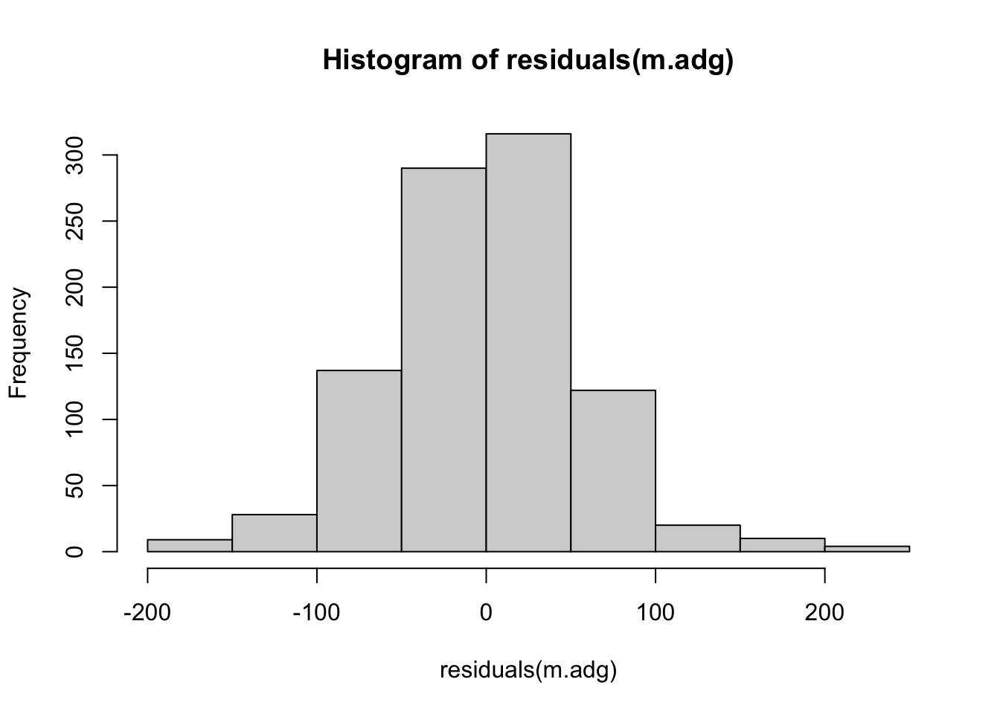
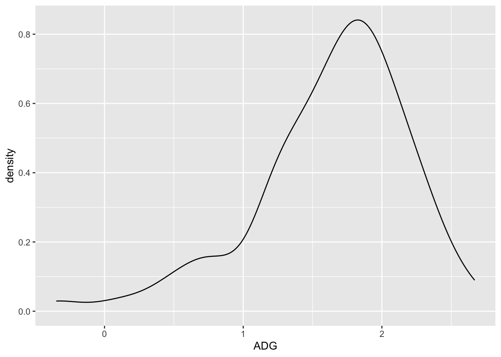

# Exploratory Data Analysis and Graphics

When approaching a data set, it is important to do due diligence and ensure that a complete understanding of the data is achieved before further analysis or publication is undertaken. This can be achieved in a number of ways, which will be enumerated below. As with any analysis, an understanding of the studies experimental design is critical to understanding what values may be expected within the data sheet, and will lend insight into what potential analysis may be conducted. 

When opening a data set, it is important to have an understanding of what to expect. This includes such things as the study design and description, and the meta-data associated with the data sheets. Meta data, at the very least, should include descriptions of the column names, and indicate the type of data you might expect to be within. It may also include information concerning individual observations, such as animals that died or were pulled from the study, why they might have been pulled, and other factors that should be considered when analyzing the data. 

File and column names should be kept as simple, yet descriptive, as possible. Use well known naming conventions, and avoid the use of spaces, instead using underscores or dots. You will quickly understand the value of having well concieved naming conventions for things you will type a lot, such as the names of columns and data frames. As we go through the class, you will likely notice some of the naming conventions that I have adopted. Feel free to use and adopt these for you own use. You will undoubtedly find a specific style which better suits your specific fancy and needs, but I think it is important that you do adopt a style for your own sanity.

## Study description 
Experimental Animals and Design: Seventy-two crossbred beef heifers (25% Bos indicus) born and raised at the McGregor AgriLife Research Center will be weaned in October at a range in age of 194-232 d. Forty-two days prior to weaning, calves will be weighed, exit velocity and chute scores (subjective temperament) recorded, and randomly allotted to 1 of 2 treatments (Control or Yeast) provided in a creep ration containing 18% CP (as-fed basis). 

Upon weaning, blood samples will be collected for analyses of IgG titers, cortisol and haptaglobian concentrations, and body weight, exit velocity and chute score data collected. At this time, 32 heifers (16 Control, 16 Yeast) will have rumen temperature boluses inserted and HOBO accelerometer devices placed on the left hind leg to record activity data. Heifers will then be placed into a holding pen with hay and water. The following day, all heifers will be loaded on to a truck and shipped approximately 800 kilometers, before being returned to the Research Center. As heifers come off the truck, blood samples will be collected to determine cortisol and haptaglobin concentrations. The heifers will be placed in holding pens for the night. The following morning, heifer calves will be weighed, vaccinated for IBR, PI3, BVD, BRSV (product?) and Mannheimia (Niplura), and chute score and exit velocity measured.  

Within creep treatment, heifers will be randomly assigned to 1 of 2 post-weaning treatments in a 2 x 2 factorial arrangement: (1) Pre-weaning Yeast and post-weaning Yeast, (2) Pre-weaning Yeast and post-weaning control, (3) Pre-weaning control and post-weaning control, and (4) Pre-weaning control and post-weaning Yeast. Heifers will be weighed at 7-d intervals and re-vaccinated on d 21 (IBR, PI3, BVD, BRSV, and Nuplora). Heifers in the 2 pens on the post-weaning Yeast treatments will be rotated every 7-d to minimize the potential pen effect. Likewise, heifers in the 2 pens on the post-weaning control treatments will be rotated weekly. Blood samples will be collected at the start of the study, and at weekly intervals to measure IgG titer responses to IBR and Mannheimia vaccinations. Individual-animal intakes and feeding behavior (e.g., bunk visit and meal frequency and duration) data will be collected daily by the GrowSafe System. Time to bunk following feed truck delivery will also be measured daily using the GrowSafe System. Throughout the trial, the system will be monitored twice daily to ensure accuracy of the feed intake data. To ensure data quality of the feed intake and feeding behavior data, the average assigned feed disappearance (AFD) rate will be computed daily, and data for all animals in a pen deleted if AFD for a given day is less than 95%. Exit velocity and chute scores (objective and subjective temperature traits) will be measured at prior to creep feeding, weaning, prior to sorting, and the end of the trial. The HOBO devices will measure physical activity. Serum cortisol and haptaglobin concentrations will be measured before and after shipping and 28-d and 56-d after the beginning of the study. Treatment premixes, and treatment total mixed ration samples will be collected weekly and stored at 20 C (refrigerator). Immediately following the completion of the study, the weekly samples will be composited by weight, and samples sent for yeast analysis. The TMR composite samples will be analyzed to obtain a complete nutritional profile. The treatment TMRs will be fed once daily, and feed bunks will be cleaned once weakly with ort samples collected and stored at 20 C as deemed necessary.  

 

``` r
# 2 Exploratory Analysis and Graphics
# Libraries ----
library(tidyverse) # Graphing 
```

```
## ── Attaching core tidyverse packages ──────────────────────── tidyverse 2.0.0 ──
## ✔ dplyr     1.1.4     ✔ readr     2.1.5
## ✔ forcats   1.0.0     ✔ stringr   1.5.1
## ✔ ggplot2   3.5.1     ✔ tibble    3.2.1
## ✔ lubridate 1.9.3     ✔ tidyr     1.3.1
## ✔ purrr     1.0.2     
## ── Conflicts ────────────────────────────────────────── tidyverse_conflicts() ──
## ✖ dplyr::filter() masks stats::filter()
## ✖ dplyr::lag()    masks stats::lag()
## ℹ Use the conflicted package (<http://conflicted.r-lib.org/>) to force all conflicts to become errors
```

``` r
library(data.table) # Reading data and manipulating data
```

```
## 
## Attaching package: 'data.table'
## 
## The following objects are masked from 'package:lubridate':
## 
##     hour, isoweek, mday, minute, month, quarter, second, wday, week,
##     yday, year
## 
## The following objects are masked from 'package:dplyr':
## 
##     between, first, last
## 
## The following object is masked from 'package:purrr':
## 
##     transpose
```

``` r
library(readxl) # Reading excel

# Data -----
excel_sheets(path = '../Data/LAN/LAN_1504_DATA.xlsx')
```

```
##  [1] "Notes"                "LAN_1504"             "Graphs"              
##  [4] "Sheet1"               "Charts"               "date_relative"       
##  [7] "RawWeight(lbs)"       "Day28_IntakeSAS"      "ADJ_28Day_Intake"    
## [10] "ADJ_28Day_BW"         "Day28_RFI"            "Day56_IntakeSAS"     
## [13] "ADJ_56Day_Intake"     "ADJ_56Day_BW"         "Day56_RFI"           
## [16] "Day70_Intake_SAS"     "ADJ_70Day_Intake"     "ADJ_Day70_BW"        
## [19] "Day70_RFI"            "TTBxAnimalxDay"       "TTB"                 
## [22] "AveragexDay"          "Final Data"           "Day14_outputallday"  
## [25] "Day14_outputallhour"  "Day42_outputallday"   "Day42_outputallhour" 
## [28] "outputallday_cmbnd"   "outputallhour_combnd" "D-1"                 
## [31] "D0"                   "D28"                  "D56"
```

``` r
d.bw = read_excel(path = '../Data/LAN/LAN_1504_DATA.xlsx',
                   sheet = "RawWeight(lbs)")

# Summary Statistics -----
str(d.bw)
```

```
## tibble [78 × 21] (S3: tbl_df/tbl/data.frame)
##  $ Ref ID       : num [1:78] 1 2 3 4 5 6 7 8 9 10 ...
##  $ VID          : num [1:78] 248 249 276 298 322 346 364 367 453 472 ...
##  $ EID          : num [1:78] 9.82e+14 9.82e+14 9.82e+14 9.82e+14 9.82e+14 ...
##  $ Creep        : chr [1:78] "Control" "Control" "Yeast" "Yeast" ...
##  $ Trial        : chr [1:78] "Control" "Control" "Control" "Control" ...
##  $ Pen          : num [1:78] 8 8 6 6 8 6 5 7 6 5 ...
##  $ BW-42        : num [1:78] 574 463 389 436 436 416 420 352 429 402 ...
##  $ BW-1         : num [1:78] 650 514 453 504 512 446 510 390 508 485 ...
##  $ BW0          : num [1:78] 638 504 445 489 504 441 479 372 481 474 ...
##  $ BW7          : num [1:78] 636 496 450 487 532 398 481 377 492 469 ...
##  $ BW14         : num [1:78] 670 512 477 522 562 418 516 388 508 486 ...
##  $ BW21         : num [1:78] 716 544 508 530 592 443 548 411 544 522 ...
##  $ BW28         : num [1:78] 698 544 499 530 592 447 552 416 544 520 ...
##  $ BW35         : num [1:78] 732 564 534 566 600 464 584 463 558 552 ...
##  $ BW42         : num [1:78] 732 576 550 590 628 480 590 466 586 556 ...
##  $ BW49         : num [1:78] 768 600 548 578 654 468 600 478 578 560 ...
##  $ BW56         : num [1:78] 786 608 594 624 678 518 628 496 616 584 ...
##  $ BW70         : num [1:78] 806 670 636 650 702 560 676 518 650 628 ...
##  $ Shipping Loss: num [1:78] -12 -10 -8 -15 -8 -5 -31 -18 -27 -11 ...
##  $ Creep_Gain   : num [1:78] 76 51 64 68 76 30 90 38 79 83 ...
##  $ Pre-Wean_ADG : num [1:78] 1.81 1.21 1.52 1.62 1.81 ...
```

``` r
nrow(d.bw)
```

```
## [1] 78
```

``` r
unique(d.bw$VID)
```

```
##  [1] 248 249 276 298 322 346 364 367 453 472 510 538 571 661 662 663 664 667 668
## [20] 672 674 677 678 679 682 684 688 690 691 692 693 701 702 703 704 706 707 711
## [39] 712 714 717 718 719 721 722 723 724 726 727 729 731 734 735 743 744 747 749
## [58] 752 756 760 762 764 765 766 768 769 771 772 775 780 783 785 799 805 808 813
## [77] 815 821
```

``` r
length(unique(d.bw$VID))
```

```
## [1] 78
```

``` r
## Data Wrangling -----
names(d.bw)
```

```
##  [1] "Ref ID"        "VID"           "EID"           "Creep"        
##  [5] "Trial"         "Pen"           "BW-42"         "BW-1"         
##  [9] "BW0"           "BW7"           "BW14"          "BW21"         
## [13] "BW28"          "BW35"          "BW42"          "BW49"         
## [17] "BW56"          "BW70"          "Shipping Loss" "Creep_Gain"   
## [21] "Pre-Wean_ADG"
```

``` r
d.bw2 = pivot_longer(data = d.bw, cols = c(7:18))
(18-6) * length(unique(d.bw$VID))
```

```
## [1] 936
```

``` r
(18-6) * length(unique(d.bw$VID)) == nrow(d.bw2)
```

```
## [1] TRUE
```

``` r
length(unique(d.bw2$VID))
```

```
## [1] 78
```

``` r
str(d.bw2)
```

```
## tibble [936 × 11] (S3: tbl_df/tbl/data.frame)
##  $ Ref ID       : num [1:936] 1 1 1 1 1 1 1 1 1 1 ...
##  $ VID          : num [1:936] 248 248 248 248 248 248 248 248 248 248 ...
##  $ EID          : num [1:936] 9.82e+14 9.82e+14 9.82e+14 9.82e+14 9.82e+14 ...
##  $ Creep        : chr [1:936] "Control" "Control" "Control" "Control" ...
##  $ Trial        : chr [1:936] "Control" "Control" "Control" "Control" ...
##  $ Pen          : num [1:936] 8 8 8 8 8 8 8 8 8 8 ...
##  $ Shipping Loss: num [1:936] -12 -12 -12 -12 -12 -12 -12 -12 -12 -12 ...
##  $ Creep_Gain   : num [1:936] 76 76 76 76 76 76 76 76 76 76 ...
##  $ Pre-Wean_ADG : num [1:936] 1.81 1.81 1.81 1.81 1.81 ...
##  $ name         : chr [1:936] "BW-42" "BW-1" "BW0" "BW7" ...
##  $ value        : num [1:936] 574 650 638 636 670 716 698 732 732 768 ...
```

``` r
d.bw2$Day = extract_numeric(d.bw2$name)
```

```
## extract_numeric() is deprecated: please use readr::parse_number() instead
```

``` r
str(d.bw2)
```

```
## tibble [936 × 12] (S3: tbl_df/tbl/data.frame)
##  $ Ref ID       : num [1:936] 1 1 1 1 1 1 1 1 1 1 ...
##  $ VID          : num [1:936] 248 248 248 248 248 248 248 248 248 248 ...
##  $ EID          : num [1:936] 9.82e+14 9.82e+14 9.82e+14 9.82e+14 9.82e+14 ...
##  $ Creep        : chr [1:936] "Control" "Control" "Control" "Control" ...
##  $ Trial        : chr [1:936] "Control" "Control" "Control" "Control" ...
##  $ Pen          : num [1:936] 8 8 8 8 8 8 8 8 8 8 ...
##  $ Shipping Loss: num [1:936] -12 -12 -12 -12 -12 -12 -12 -12 -12 -12 ...
##  $ Creep_Gain   : num [1:936] 76 76 76 76 76 76 76 76 76 76 ...
##  $ Pre-Wean_ADG : num [1:936] 1.81 1.81 1.81 1.81 1.81 ...
##  $ name         : chr [1:936] "BW-42" "BW-1" "BW0" "BW7" ...
##  $ value        : num [1:936] 574 650 638 636 670 716 698 732 732 768 ...
##  $ Day          : num [1:936] -42 -1 0 7 14 21 28 35 42 49 ...
```

``` r
## Summary statistics
summary(d.bw)
```

```
##      Ref ID           VID             EID              Creep          
##  Min.   : 1.00   Min.   :248.0   Min.   :9.82e+14   Length:78         
##  1st Qu.:20.25   1st Qu.:672.5   1st Qu.:9.82e+14   Class :character  
##  Median :39.50   Median :713.0   Median :9.82e+14   Mode  :character  
##  Mean   :39.50   Mean   :671.2   Mean   :9.82e+14                     
##  3rd Qu.:58.75   3rd Qu.:755.0   3rd Qu.:9.82e+14                     
##  Max.   :78.00   Max.   :821.0   Max.   :9.82e+14                     
##     Trial                Pen          BW-42            BW-1      
##  Length:78          Min.   :5.0   Min.   :352.0   Min.   :380.0  
##  Class :character   1st Qu.:6.0   1st Qu.:395.5   1st Qu.:465.0  
##  Mode  :character   Median :6.5   Median :428.5   Median :501.0  
##                     Mean   :6.5   Mean   :429.3   Mean   :495.6  
##                     3rd Qu.:7.0   3rd Qu.:455.8   3rd Qu.:521.5  
##                     Max.   :8.0   Max.   :574.0   Max.   :650.0  
##       BW0             BW7             BW14            BW21      
##  Min.   :364.0   Min.   :334.0   Min.   :345.0   Min.   :370.0  
##  1st Qu.:449.0   1st Qu.:439.0   1st Qu.:440.2   1st Qu.:470.2  
##  Median :476.0   Median :466.5   Median :476.5   Median :507.0  
##  Mean   :475.3   Mean   :464.9   Mean   :478.9   Mean   :507.6  
##  3rd Qu.:502.0   3rd Qu.:491.8   3rd Qu.:511.5   3rd Qu.:543.5  
##  Max.   :638.0   Max.   :636.0   Max.   :670.0   Max.   :716.0  
##       BW28            BW35            BW42            BW49      
##  Min.   :364.0   Min.   :380.0   Min.   :383.0   Min.   :400.0  
##  1st Qu.:473.5   1st Qu.:490.2   1st Qu.:500.8   1st Qu.:521.5  
##  Median :507.0   Median :534.0   Median :547.0   Median :559.0  
##  Mean   :507.2   Mean   :532.4   Mean   :542.5   Mean   :557.3  
##  3rd Qu.:544.0   3rd Qu.:567.5   3rd Qu.:579.5   3rd Qu.:596.0  
##  Max.   :698.0   Max.   :732.0   Max.   :732.0   Max.   :768.0  
##       BW56            BW70       Shipping Loss       Creep_Gain    
##  Min.   :398.0   Min.   :412.0   Min.   :-116.00   Min.   : 13.00  
##  1st Qu.:538.5   1st Qu.:572.5   1st Qu.: -26.75   1st Qu.: 51.00  
##  Median :585.0   Median :622.0   Median : -18.00   Median : 68.00  
##  Mean   :579.4   Mean   :614.2   Mean   : -20.28   Mean   : 66.27  
##  3rd Qu.:619.5   3rd Qu.:655.0   3rd Qu.: -12.00   3rd Qu.: 79.75  
##  Max.   :786.0   Max.   :806.0   Max.   :   2.00   Max.   :186.00  
##   Pre-Wean_ADG   
##  Min.   :0.3095  
##  1st Qu.:1.2143  
##  Median :1.6190  
##  Mean   :1.5778  
##  3rd Qu.:1.8988  
##  Max.   :4.4286
```

``` r
summary(d.bw2)
```

```
##      Ref ID          VID             EID              Creep          
##  Min.   : 1.0   Min.   :248.0   Min.   :9.82e+14   Length:936        
##  1st Qu.:20.0   1st Qu.:672.0   1st Qu.:9.82e+14   Class :character  
##  Median :39.5   Median :713.0   Median :9.82e+14   Mode  :character  
##  Mean   :39.5   Mean   :671.2   Mean   :9.82e+14                     
##  3rd Qu.:59.0   3rd Qu.:756.0   3rd Qu.:9.82e+14                     
##  Max.   :78.0   Max.   :821.0   Max.   :9.82e+14                     
##     Trial                Pen      Shipping Loss       Creep_Gain    
##  Length:936         Min.   :5.0   Min.   :-116.00   Min.   : 13.00  
##  Class :character   1st Qu.:6.0   1st Qu.: -27.00   1st Qu.: 51.00  
##  Mode  :character   Median :6.5   Median : -18.00   Median : 68.00  
##                     Mean   :6.5   Mean   : -20.28   Mean   : 66.27  
##                     3rd Qu.:7.0   3rd Qu.: -12.00   3rd Qu.: 80.00  
##                     Max.   :8.0   Max.   :   2.00   Max.   :186.00  
##   Pre-Wean_ADG        name               value            Day        
##  Min.   :0.3095   Length:936         Min.   :334.0   Min.   :-42.00  
##  1st Qu.:1.2143   Class :character   1st Qu.:461.0   1st Qu.:  5.25  
##  Median :1.6190   Mode  :character   Median :510.0   Median : 24.50  
##  Mean   :1.5778                      Mean   :515.4   Mean   : 23.25  
##  3rd Qu.:1.9048                      3rd Qu.:562.0   3rd Qu.: 43.75  
##  Max.   :4.4286                      Max.   :806.0   Max.   : 70.00
```

``` r
d.bw2 %>% # Calculating summary statistics from long data by day
  group_by(Day) %>% 
  summarise(mean = mean(value),
            SD = sd(value),
            min = min(value),
            max = max(value))
```

```
## # A tibble: 12 × 5
##      Day  mean    SD   min   max
##    <dbl> <dbl> <dbl> <dbl> <dbl>
##  1   -42  429.  41.3   352   574
##  2    -1  496.  47.2   380   650
##  3     0  475.  44.6   364   638
##  4     7  465.  49.5   334   636
##  5    14  479.  54.8   345   670
##  6    21  508.  57.8   370   716
##  7    28  507.  58.4   364   698
##  8    35  532.  59.1   380   732
##  9    42  542.  61.4   383   732
## 10    49  557.  64.1   400   768
## 11    56  579.  64.8   398   786
## 12    70  614.  68.6   412   806
```

``` r
d.bw2 %>% 
  group_by(VID) %>% 
  summarise(mean = mean(value),
            SD = sd(value),
            min = min(value),
            max = max(value))
```

```
## # A tibble: 78 × 5
##      VID  mean    SD   min   max
##    <dbl> <dbl> <dbl> <dbl> <dbl>
##  1   248  700.  69.3   574   806
##  2   249  550.  57.6   463   670
##  3   276  507.  69.7   389   636
##  4   298  542.  61.6   436   650
##  5   322  583.  77.8   436   702
##  6   346  458.  45.1   398   560
##  7   364  549.  71.8   420   676
##  8   367  427.  54.7   352   518
##  9   453  541.  61.7   429   650
## 10   472  520.  60.8   402   628
## # ℹ 68 more rows
```


``` r
# Check for NA's 
days = seq(min(d.bw2$Day), max(d.bw2$Day), by = 1)
Days = data.table(Day = days)
d.bw2 = as.data.table(d.bw2)
VIDs = data.table(VID = unique(d.bw2$VID))
78*113
```

```
## [1] 8814
```

``` r
d.bw3 = merge.data.table(d.bw2,Days, all = T)
unique(d.bw3$Day)
```

```
##   [1] -42 -41 -40 -39 -38 -37 -36 -35 -34 -33 -32 -31 -30 -29 -28 -27 -26 -25
##  [19] -24 -23 -22 -21 -20 -19 -18 -17 -16 -15 -14 -13 -12 -11 -10  -9  -8  -7
##  [37]  -6  -5  -4  -3  -2  -1   0   1   2   3   4   5   6   7   8   9  10  11
##  [55]  12  13  14  15  16  17  18  19  20  21  22  23  24  25  26  27  28  29
##  [73]  30  31  32  33  34  35  36  37  38  39  40  41  42  43  44  45  46  47
##  [91]  48  49  50  51  52  53  54  55  56  57  58  59  60  61  62  63  64  65
## [109]  66  67  68  69  70
```

``` r
summary(d.bw3)
```

```
##       Day             Ref ID          VID             EID          
##  Min.   :-42.00   Min.   : 1.0   Min.   :248.0   Min.   :9.82e+14  
##  1st Qu.:  0.00   1st Qu.:20.0   1st Qu.:672.0   1st Qu.:9.82e+14  
##  Median : 21.00   Median :39.5   Median :713.0   Median :9.82e+14  
##  Mean   : 22.24   Mean   :39.5   Mean   :671.2   Mean   :9.82e+14  
##  3rd Qu.: 42.00   3rd Qu.:59.0   3rd Qu.:756.0   3rd Qu.:9.82e+14  
##  Max.   : 70.00   Max.   :78.0   Max.   :821.0   Max.   :9.82e+14  
##                   NA's   :101    NA's   :101     NA's   :101       
##     Creep              Trial                Pen      Shipping Loss    
##  Length:1037        Length:1037        Min.   :5.0   Min.   :-116.00  
##  Class :character   Class :character   1st Qu.:6.0   1st Qu.: -27.00  
##  Mode  :character   Mode  :character   Median :6.5   Median : -18.00  
##                                        Mean   :6.5   Mean   : -20.28  
##                                        3rd Qu.:7.0   3rd Qu.: -12.00  
##                                        Max.   :8.0   Max.   :   2.00  
##                                        NA's   :101   NA's   :101      
##    Creep_Gain      Pre-Wean_ADG        name               value      
##  Min.   : 13.00   Min.   :0.3095   Length:1037        Min.   :334.0  
##  1st Qu.: 51.00   1st Qu.:1.2143   Class :character   1st Qu.:461.0  
##  Median : 68.00   Median :1.6191   Mode  :character   Median :510.0  
##  Mean   : 66.27   Mean   :1.5778                      Mean   :515.4  
##  3rd Qu.: 80.00   3rd Qu.:1.9048                      3rd Qu.:562.0  
##  Max.   :186.00   Max.   :4.4286                      Max.   :806.0  
##  NA's   :101      NA's   :101                         NA's   :101
```


``` r
# Calculate ADG ----
d.bw2$VID = as.character(d.bw2$VID)
str(d.bw2)
```

```
## Classes 'data.table' and 'data.frame':	936 obs. of  12 variables:
##  $ Ref ID       : num  1 1 1 1 1 1 1 1 1 1 ...
##  $ VID          : chr  "248" "248" "248" "248" ...
##  $ EID          : num  9.82e+14 9.82e+14 9.82e+14 9.82e+14 9.82e+14 ...
##  $ Creep        : chr  "Control" "Control" "Control" "Control" ...
##  $ Trial        : chr  "Control" "Control" "Control" "Control" ...
##  $ Pen          : num  8 8 8 8 8 8 8 8 8 8 ...
##  $ Shipping Loss: num  -12 -12 -12 -12 -12 -12 -12 -12 -12 -12 ...
##  $ Creep_Gain   : num  76 76 76 76 76 76 76 76 76 76 ...
##  $ Pre-Wean_ADG : num  1.81 1.81 1.81 1.81 1.81 ...
##  $ name         : chr  "BW-42" "BW-1" "BW0" "BW7" ...
##  $ value        : num  574 650 638 636 670 716 698 732 732 768 ...
##  $ Day          : num  -42 -1 0 7 14 21 28 35 42 49 ...
##  - attr(*, ".internal.selfref")=<externalptr>
```

``` r
m.adg = lm(value ~ Day, data = d.bw2)
summary(m.adg)
```

```
## 
## Call:
## lm(formula = value ~ Day, data = d.bw2)
## 
## Residuals:
##      Min       1Q   Median       3Q      Max 
## -179.964  -34.337    0.374   36.372  216.971 
## 
## Coefficients:
##              Estimate Std. Error t value Pr(>|t|)    
## (Intercept) 477.28860    2.43741  195.82   <2e-16 ***
## Day           1.63822    0.06541   25.04   <2e-16 ***
## ---
## Signif. codes:  0 '***' 0.001 '**' 0.01 '*' 0.05 '.' 0.1 ' ' 1
## 
## Residual standard error: 58.27 on 934 degrees of freedom
## Multiple R-squared:  0.4017,	Adjusted R-squared:  0.4011 
## F-statistic: 627.2 on 1 and 934 DF,  p-value: < 2.2e-16
```

``` r
hist(residuals(m.adg))
```



``` r
shapiro.test(residuals(m.adg))
```

```
## 
## 	Shapiro-Wilk normality test
## 
## data:  residuals(m.adg)
## W = 0.98986, p-value = 4.643e-06
```

``` r
d.bw2$pBW = predict(m.adg)

d.bw2 %>% 
  ggplot(aes(x = Day))+
  geom_line(aes(y = pBW), color = 'blue')+
  geom_point(aes(y = value), color = 'red')
```


``` r
# ADG whole Period ----
d.bw2 = as.data.table(d.bw2)

d.bw2[VID == '249', list(initialBW=coef(lm(value ~ Day))[1], 
                         ADG=coef(lm(value~Day))[2],
                         NoWeights = length(unique(Day)))]
```

```
##    initialBW      ADG NoWeights
##        <num>    <num>     <int>
## 1:  507.8051 1.796914        12
```

``` r
d.bw2.249 = d.bw2[VID == '249',]
m.249 = lm(value ~ Day, data = d.bw2.249)
summary(m.249)
```

```
## 
## Call:
## lm(formula = value ~ Day, data = d.bw2.249)
## 
## Residuals:
##     Min      1Q  Median      3Q     Max 
## -24.383  -8.986  -2.673   5.108  36.411 
## 
## Coefficients:
##             Estimate Std. Error t value Pr(>|t|)    
## (Intercept) 507.8051     7.1012  71.510 6.98e-15 ***
## Day           1.7969     0.1906   9.429 2.72e-06 ***
## ---
## Signif. codes:  0 '***' 0.001 '**' 0.01 '*' 0.05 '.' 0.1 ' ' 1
## 
## Residual standard error: 19.22 on 10 degrees of freedom
## Multiple R-squared:  0.8989,	Adjusted R-squared:  0.8888 
## F-statistic:  88.9 on 1 and 10 DF,  p-value: 2.718e-06
```

``` r
coef(lm(value~Day, data = d.bw2.249))[1]
```

```
## (Intercept) 
##    507.8051
```

``` r
d.adg = d.bw2[,list(initialBW=coef(lm(value ~ Day))[1], 
                    ADG=coef(lm(value~Day))[2],
                    NoWeights = length(unique(Day))),
              by=VID]
```

## Graphs

``` r
# Summary graphs ----

d.adg %>% 
  ggplot(aes(x = ADG))+
  geom_histogram()+
  geom_vline(aes(xintercept = mean(d.adg$ADG)), color = 'red')
```

```
## `stat_bin()` using `bins = 30`. Pick better value with `binwidth`.
```


``` r
d.adg %>% 
  ggplot(aes(x = ADG))+
  geom_density()
```



``` r
d.bw2 %>% 
  ggplot(aes(x = Day, y = value, color = Creep))+
  geom_point()+
  geom_smooth(method = 'lm', se = F)
```

```
## `geom_smooth()` using formula = 'y ~ x'
```


