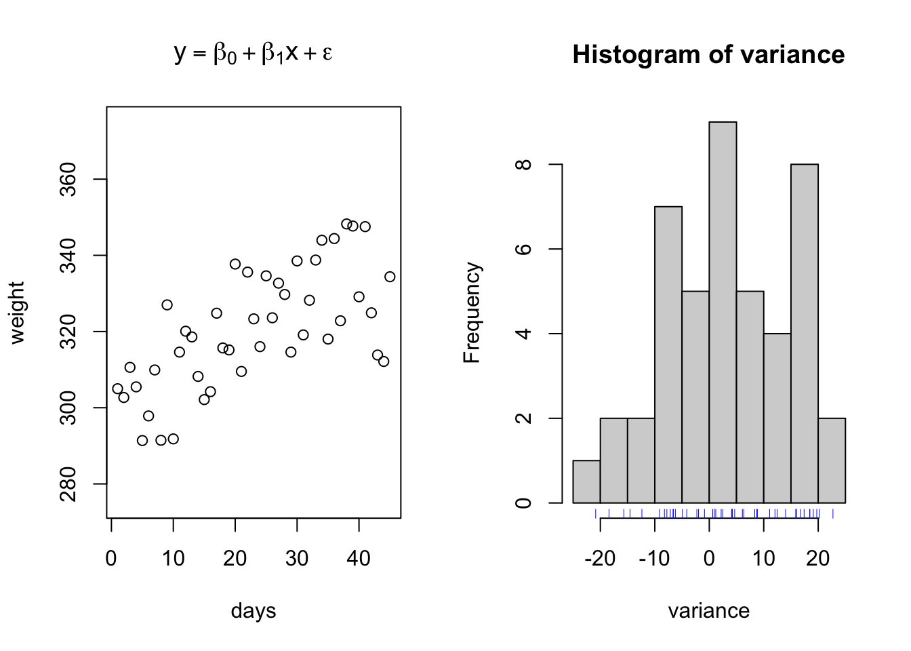

# Science
## How you know what you know, and is what you know really so?

Science -

- The systematic study of the structure and behavior of the physical and natural world through observation, experimentation, and the testing of theories against the evidence obtained. *Oxford dictionary*

- knowledge or a system of knowledge covering general truths or the operation of general laws especially as obtained and tested through the scientific method. *Merriam Webster*

- knowledge from the careful study of the structure and behavior of the physical world, especially by watching, measuring, and doing experiments, and the  development of theories to describe the results from these activities. *Cambridge dictionary*

## History of scientific inquiry


## Paradigms of Statistical Inference


``` r
{
fun1 = function(x,b0,b1){y = b0 + x*b1}

days = seq(1,45,1) # Days in a feeding trial
initialweight = 300 # Initial bodyweight
gain = 0.75 # Average Daily Gain, Kgs per day
weight = fun1(days, b0 = initialweight, b1 = gain) # Equation for what the animal weighs on each day through the trial
plot(days,weight, ylim = c(275,375), main = expression(y == beta[0] + beta[1]*x))
abline(lm(weight~days), col = 'blue')
}
```


``` r
fun1 = function(x,b0,b1,e){y = b0 + x*b1 + e}

days = seq(1,45,1) # Days in a feeding trial
initialweight = 300 # Initial bodyweight
gain = 0.75 # Average Daily Gain, Kgs per day
variance = rnorm(n = length(days), mean = 0, sd = 10)
weight = fun1(x = days,b0 = initialweight, b1 = gain, e = variance) # Equation for what the animal weighs on each day through the trial
par(mfrow = c(1,2))

{
plot(days,weight, ylim = c(275,375), main = expression(y == beta[0] + beta[1]*x + epsilon))
# abline(lm(weight~days), col = 'blue')
}
{
hist(variance)
rug(variance, col = 'blue')
}
```


