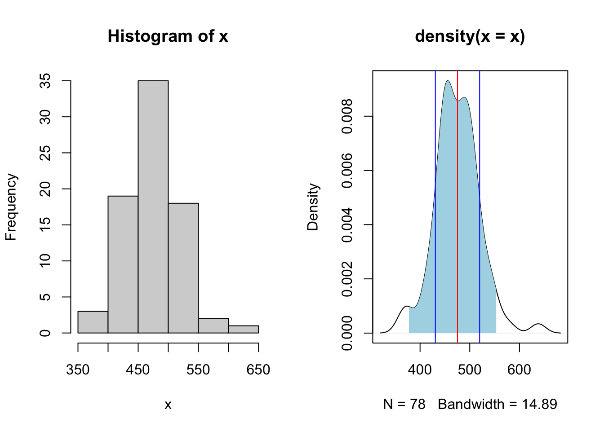
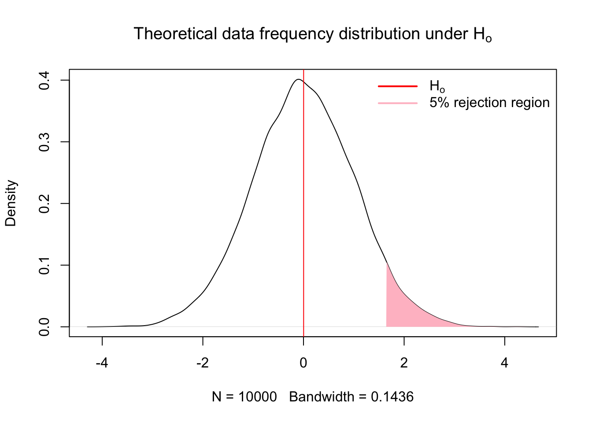
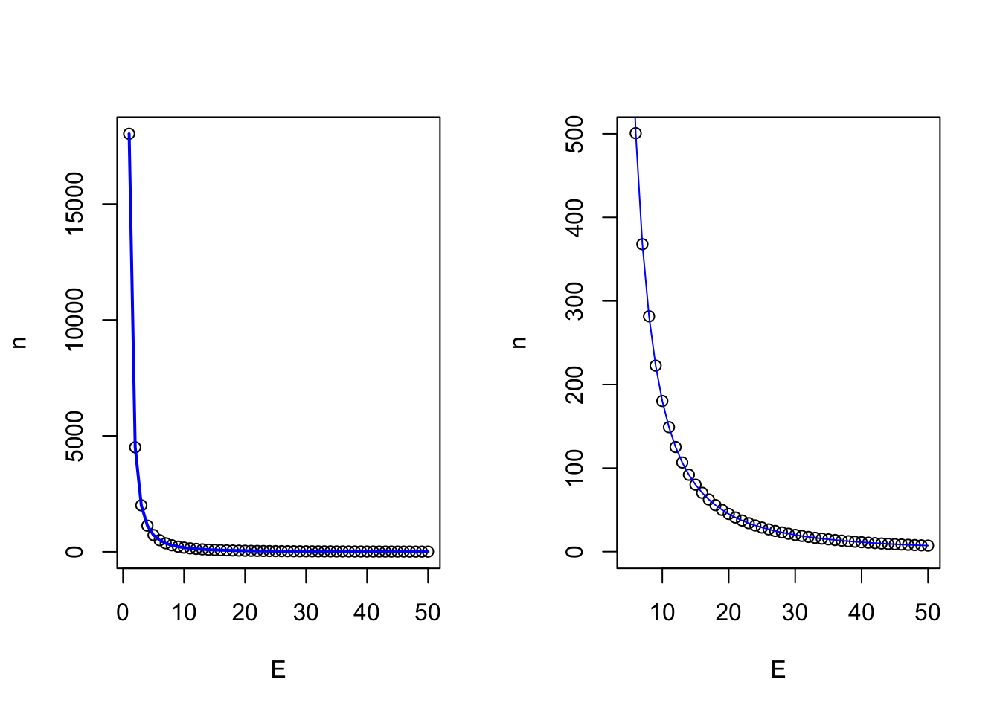
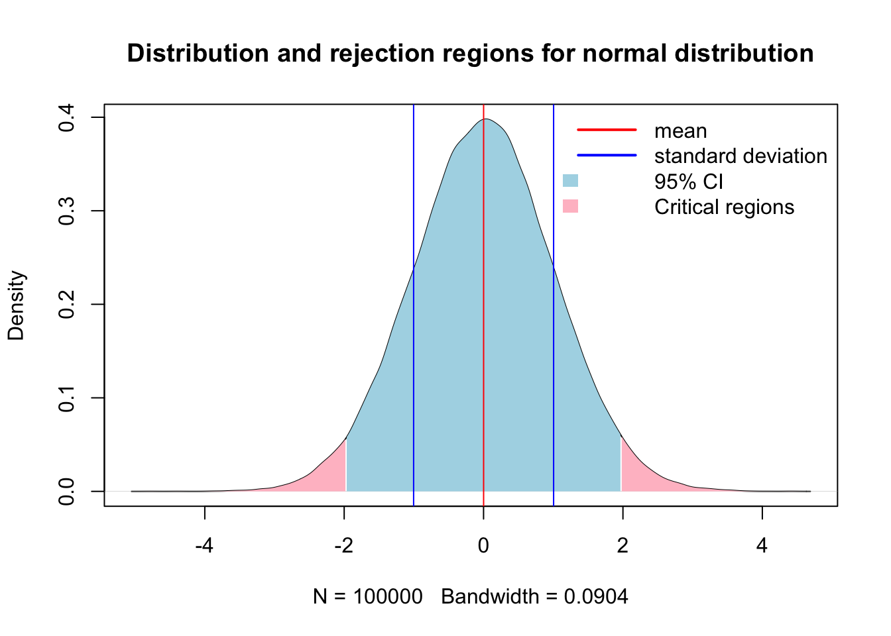
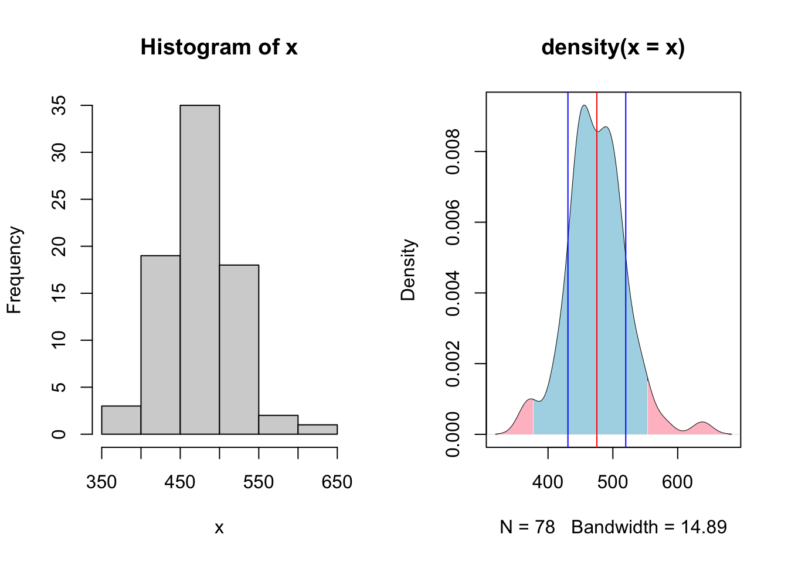
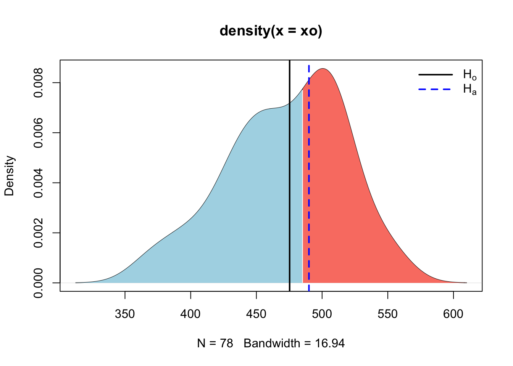
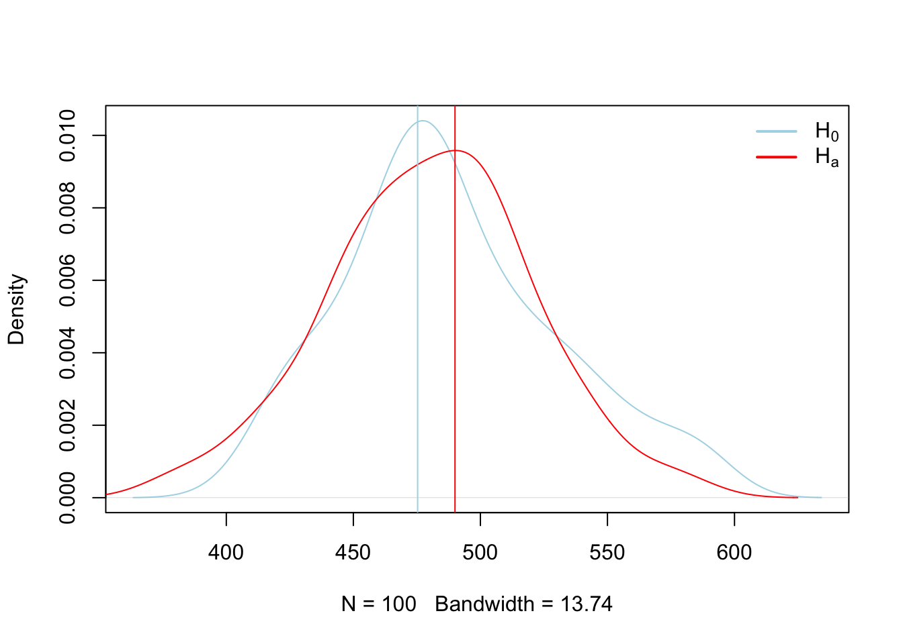
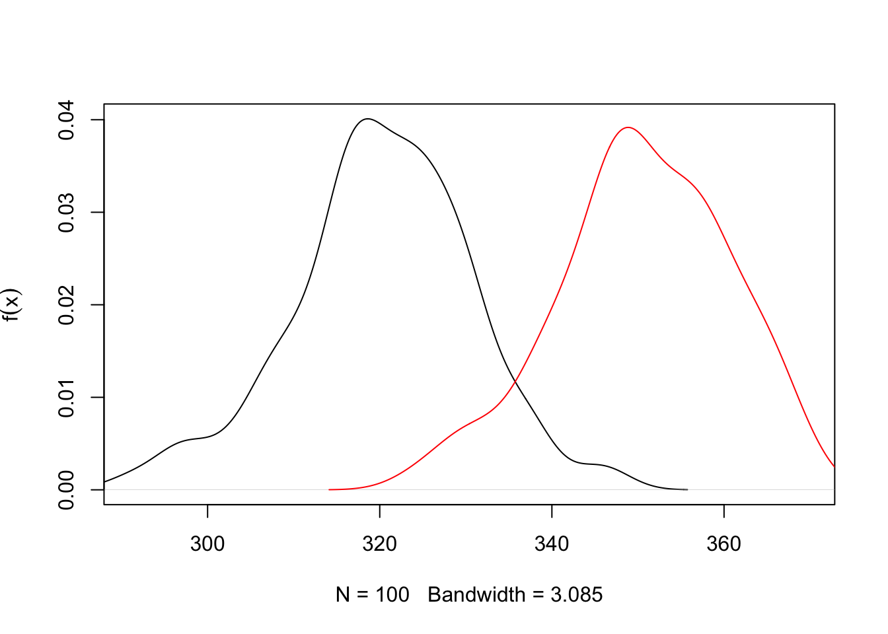

# Standard Statistics

This is the section that most of you will find more familiar as we cover concepts typically considered "classical" statistics. Studying complex systems with high levels of natural variability requires utilization of statistics to infer pattern and causation from data.  

## Fisher  

1. Select an appropriate test
2. Set up a null hypothesis $H_o$
3. Calculate the theoretical probability of the results under $H_o$
4. Assess the statistical significance of the results
5. Interpret the statistical significance of the results.


1. The appropriate test 

After selecting an appropriate test, it is important to define the null hypothesis and select the appropriate tests [@fisherInverseProbabilityUse1932]. 

2. Set up the null hypothesis $H_o$. The $H_o$ derives naturally from the test selected. An example would be the comparison of two population central values (e.g. $M_1 - M_2 = 0$) or more comparatively $M_1 ≠ 0$. 

Some parameters of the distribution are calculated from the sample i.e. variance and degress of freedom
The rest of the parameters are estimated according to the theoretical distribution.

3. Calculate theoretical probability of results under the $H_o$ hypothesis
Here is an example of the frequency distribution for data operating under the assumption that $H_o$ is true


``` r
x = rnorm(10000, mean = 0, sd = 1)
x.den = density(x)

{
  plot(x.den, main = expression("Theoretical data frequency distribution under H"[o]))
  abline(v = mean(x), col = 'red')
  legend("topright", 
       legend = expression(H[o]),
       col = c("red"), 
       border = NA,
       lty = 1, 
       lwd = 2,
       seg.len = 3,
       bty = "n")
}
```



4. Assess significance of results

Fisher proposed tests of significance that were based on identifying results with low probability of occuring under the null hypothesis [@perezgonzalezFisherNeymanPearsonNHST2015]. A research result with a low p-value, i.e. a low probability of occuring under the theoretrical distribution of the null hypothesis, may be taken as evidence against the null hypothesis. [@perezgonzalezFisherNeymanPearsonNHST2015]. How small of a result may be considered significant is the pervue of the researcher [@fisherDesignExperiments1960; @perezgonzalezFisherNeymanPearsonNHST2015] or the reader, which is why reporting test statistics and p-values are important. If the p-value is equal to or smaller than the chosen significance level, the results are taken as evidence against the null hypothesis and deemed significant.

5. Interpretation of the results

A significant result is representative of a dual statement. Either a rare result that occurs only with a probability of p, or lower, just happened, or the null hypothesis failed to explain the datum collected by the research. A literal intrepretation of the results is that the null hypothesis did not explain our data, thus we infered other processes.


``` r
x = rnorm(10000, mean = 0, sd = 1)
x.den = density(x)
# Compute the 95th percentile
q95 = quantile(x, 0.95)
# Identify the portion of the density curve above the 95th percentile
x.shade = x.den$x[x.den$x >= q95]
y.shade = x.den$y[x.den$x >= q95]

{
  plot(x.den, main = expression("Theoretical data frequency distribution under H"[o]))
  abline(v = mean(x), col = 'red')
  # Add shaded polygon for upper 5%
  polygon(c(q95, x.shade, max(x.shade)), 
        c(0, y.shade, 0), 
        col = 'pink', 
        border = NA)
    legend("topright", 
       legend = c(expression(H[o]), '5% rejection region'),
       col = c("red", 'pink'), 
       border = NA,
       lty = 1, 
       lwd = 2,
       seg.len = 3,
       bty = "n")
}
```



## Neyman-Pearson


``` r
set.seed(3)
d = 0.75

par(mfrow = c(1,2))
p1 = rnorm(1000, mean = 0, sd = 1)
p2 = rnorm(1000, mean = d, sd = 1)

p1.den = density(p1)
p2.den = density(p2)

xo = rnorm(100, mean=0, sd=0.5)
xa = rnorm(100, mean = d, sd = 0.5)

xo.den = density(xo)
xa.den = density(xa)

{
  plot(p1.den, col = 'blue', lty = 1, main = 'population')
  lines(p2.den, col = 'red', lty = 2)
  abline(v = c(mean(xo), mean(xa)), col = c('blue','red'))
  
  plot(xo.den, col = 'blue', lty = 1, main = 'sample')
  lines(xa.den, col = 'red', lty = 2)
  abline(v = c(mean(xo), mean(xa)), col = c('blue','red'))
}
```



## Null Hypothesis Testing   

Null Hypothesis Significance Testing has been extensively used to make inference and test hypothesis [@stephensInferenceEcologyEvolution2007], but has also experienced extensive criticism due to the logical fallacies associated with the assumptions required to make inference regarding test statistics [@hagenPraiseNullHypothesis; @sedgwickTrialsTribulationsTeaching; @wuThereIntrinsicLogical2018]. Whichever side of the fence you fall on, you should be aware of both the arguments for and against the utilization of NHST and by extension **p-values** in making scientific inference. After extensive reading, I will give you my anedotal opionion as of today (09/17/2025) of the issue. Whatever inferential paradigm you choose to use for your research is warranted providing you understand the underlying assumptions the statistical test makes, and exactly what each test statistic is testing [@hagenPraiseNullHypothesis; @wassersteinASAStatementValues2016]. The most common critique of NHST that I have observed is that scientists and statisticians are not trained how to use tests appropriately, resulting in errant results being reported [@hagenPraiseNullHypothesis; @ioannidisWhyMostPublished2005].

The magnitude of statistical tests designed for numerous experimental frameworks lend to the problem. Scientists without formal training in the choice of statistical tests are often highly motivated to find *significant* results, that is, to reject som $H_o$ hypothesis in support of the $H_A$. This motivation is counter to the primary motivation of NHST, which is to reject the $H_o$ with trepidation [@perezgonzalezFisherNeymanPearsonNHST2015]. This encourages researchers to go in search of *significant* results by utilizing any number of seemingly plausible available methods to obtain results which we find either either interesting, plausible, personally gratifying, or worse, important for the success of our career. However, whether made through ignorance or malice, that fact that we may report erroneous research results, and that most research results which we may build our research careers on are false [@ioannidisWhyMostPublished2005], should give us at least momentary pause. 

Due to the magnitude of potential scientific tests, which fill tomes of literature and giant volumes of books, teaching standardized statistics which seek to make inference of population central values and affirm or nullify $H_o$ is extremely difficult task to undertake in the limited time we have here. Add in the conflation of **posterior** and **apriori** tests, and the conflation of the two, along with nonparametric and parametric tests, creating a clear picture of statistical analysis becomes difficult. So what should we do? I believe the answer rests in the application of two first principles. The first is to hold yourself to the highest set of moral ideals, seeking to reinforce your research findings through severe critique of the results by testing their endurance through multiple tests and alignment with quality research [@mayoStatisticalInferenceSevere2018]. Secondly and of equal importance is to put in serious effort to read and understand the machinery of statistical tests and their underlying assumptions to ensure that the hypothesis you're testing is the inference they are making [@wuThereIntrinsicLogical2018]. 

### Population central values

Making inference about a population is the foundation of beginning a good statistical analysis, and often starts in the exploratory analysis we began to explore in chapter 2. A population takes on numerical descriptive values known as parameters. Typical parameters of a population is the *mean* ($u$), *median* (*M*), standard deviation ($σ$), and proportion ($π$) [@ottStatisticalMethodsData2016]. For the purposes of hypothesis testing, we will make inference of these parameters in one of two ways. First is to *estimate* the value of the population, or we will *test a hypothesis*. The 95% confidence interval is the calculated interval over which 95% of the data will fall given a normal distribution around the central value, $u$ in this case. The 95% confidence interval can be retrieved using the **quantile** function in R, or calculated using the equation of $u ± 1.96σ/√n$.

Here is an example of creating a population with known values of:

N 10000 population size
mean of 0
standard deviation of 1


``` r
n = 10000 # Population size
u = 0 # population mean or central value
sd = 1 # Standard deviation
x = rnorm(100000, mean = u, sd = sd)
x.den = density(x)

# 95% confidence interval time
q0.025 = quantile(x, 0.025)
q0.975 = quantile(x, 0.975)

# Identify x-values within the 95% CI
x.ci <- x.den$x[x.den$x >= q0.025 & x.den$x <= q0.975]
y.ci <- x.den$y[x.den$x >= q0.025 & x.den$x <= q0.975]
# Identify the portion of the density curve above the 97.5th percentile
x.upper = x.den$x[x.den$x >= q0.975]
y.upper = x.den$y[x.den$x >= q0.975]
# Identify the portion of the density curve below the 0.025th percentile
x.lower = x.den$x[x.den$x <= q0.025]
y.lower = x.den$y[x.den$x <= q0.025]

{
  plot(x.den, main = 'Distribution and rejection regions for normal distribution')
  # Add shaded polygon for 95% CI
  polygon(c(x.ci[1], x.ci, x.ci[length(x.ci)]),
        c(0, y.ci, 0),
        col = 'lightblue', border = NA)
  polygon(c(x.upper[1], x.upper, x.upper[length(x.upper)]),
        c(0, y.upper, 0),
        col = 'pink', border = NA)
  polygon(c(x.lower[1], x.lower, x.lower[length(x.lower)]),
        c(0, y.lower, 0),
        col = 'pink', border = NA)
  abline(v = c(mean(x)-sd(x),mean(x), mean(x)+sd(x)), col = c('blue','red','blue'))
  
legend("topright", 
       legend = c('mean','standard deviation', '95% CI','Critical regions'),
       col = c("red",'blue',NA), 
       fill = c(NA,NA,'lightblue','pink'),
       border = NA,
       lty = c(1,1,NA,NA), 
       lwd = c(2,2,NA,NA),
       seg.len = 3,
       bty = "n")
}
```



Now lets do that in one of our example datasets.


``` r
library(qthink)
data("bodyweight")
x = bodyweight$BW0
x.den = density(x)

# 95% confidence interval time
q0.025 = quantile(x, 0.025)
q0.975 = quantile(x, 0.975)

# Identify x-values within the 95% CI
x.ci <- x.den$x[x.den$x >= q0.025 & x.den$x <= q0.975]
y.ci <- x.den$y[x.den$x >= q0.025 & x.den$x <= q0.975]
# Identify the portion of the density curve above the 97.5th percentile
x.upper = x.den$x[x.den$x >= q0.975]
y.upper = x.den$y[x.den$x >= q0.975]
# Identify the portion of the density curve below the 0.025th percentile
x.lower = x.den$x[x.den$x <= q0.025]
y.lower = x.den$y[x.den$x <= q0.025]

par(mfrow = c(1,2))

{
  hist(x)
  plot(x.den)
  # Add shaded polygon for 95% CI
  polygon(c(x.ci[1], x.ci, x.ci[length(x.ci)]),
        c(0, y.ci, 0),
        col = 'lightblue', border = NA)
    polygon(c(x.upper[1], x.upper, x.upper[length(x.upper)]),
        c(0, y.upper, 0),
        col = 'pink', border = NA)
  polygon(c(x.lower[1], x.lower, x.lower[length(x.lower)]),
        c(0, y.lower, 0),
        col = 'pink', border = NA)
  abline(v = c(mean(x)-sd(x),mean(x), mean(x)+sd(x)), col = c('blue','red','blue'))
# legend("topright", 
#        legend = c('mean','standard deviation', '95% CI'),
#        col = c("red",'blue',NA), 
#        fill = c(NA,NA,'lightblue'),
#        border = NA,
#        lty = c(1,1,NA), 
#        lwd = c(2,2,NA),
#        seg.len = 1,
#        bty = "n")
}
```



Here we see a the same values of our population of bodyweights on day 0 from our heifers. Note how they do not follow the neat normal distribution, but do approximate it closely enough, at least visually. Here arises one of the first critiques of NHST that all tests assume that the population distribution follows a normal bell curve if enough samples are taken. 

#### Statistical test for u {-}

Lets suppose that we have another sample of heifers, perhaps the next years. (keep in mind that at this point we are not considering any treatment options, the only comparison is a made up central value, mean, compared to the current central mean of the current population). See below for the code if you're not following.


``` r
n = length(unique(bodyweight$VID))
uo = mean(bodyweight$BW0) # Mean from previous measurements
u = 490 # Our new made up mean
sd = sd(bodyweight$BW0) # our estimation of bodyweight based upon previous data
```

We choose a critical value of 0.05 to serve as our indicator of significance, i.e. a p value of <= 0.05 is considered significant. This translates to a any value greater than 1.96 standard deviations from the $H_o$ mean is considered significant. This can be mathematically calculated using the equation $z = (\bar{y} - u_o)/ (\sigma / \sqrt n)$ and takes on the following calculation in code.


``` r
z = (u - uo)/(sd/sqrt(n))
z
```

```
## [1] 2.911734
```

So here we see that our new (made up) test statistic is 2.9117336 above the central value of the population of heifers on day zero in the current dataset. This can be graphically described, demonstrated as follows.


``` r
xo = rnorm(n = n, mean = uo, sd = sd)
xo.den = density(xo)

# Critical quantile
q95 = 1.96*(sd/sqrt(n)) + uo

# Identify x-values within the 95% CI
x.ci = xo.den$x[xo.den$x <= q95]
y.ci = xo.den$y[xo.den$x <= q95]

# Right tail: x > q975
x.upper = xo.den$x[xo.den$x >= q95]
y.upper = xo.den$y[xo.den$x >= q95]

{
  plot(xo.den)
  # Add shaded polygon for 95% CI
  polygon(c(x.ci[1], x.ci, x.ci[length(x.ci)]),
        c(0, y.ci, 0),
        col = 'lightblue', border = NA)

  # Shade right rejection region
  polygon(c(x.upper[1], x.upper, x.upper[length(x.upper)]),
          c(0, y.upper, 0),
          col = 'salmon', border = NA)
  abline(v = c(uo, u), col = c('black', 'blue'), lty = c(1,2), lwd = c(2,2))
  
legend("topright",
       legend = c(expression('H'[o]), expression('H'[a])),
       col = c("black",'blue'),
       border = NA,
       lty = c(1,2),
       lwd = c(2,2),
       seg.len = 3,
       bty = "n")
}
```



Here we calculated the rejection region for the distribution constructed under $H_o$ and then observed where our new mean fell. Since it fell in the rejection region, we can assume that it was not constructed under the same theoretical process used to construct the $H_o$ distribution, and thus we can reject it. However, those processes may look similar, and we can see that by sampling observations from each of the $H_o$ and $H_a$ theoretical processes we just compared above and plotting them graphically.


``` r
set.seed(1)
x = rnorm(100, mean = uo, sd = sd)
xo = rnorm(100, mean = u, sd = sd)
t.test(x)
```

```
## 
## 	One Sample t-test
## 
## data:  x
## t = 119.85, df = 99, p-value < 2.2e-16
## alternative hypothesis: true mean is not equal to 0
## 95 percent confidence interval:
##  472.2023 488.1008
## sample estimates:
## mean of x 
##  480.1516
```

``` r
x.den = density(x)
x0.den = density(xo)
f = ecdf(xo)
f(0)
```

```
## [1] 0
```

``` r
{
  plot(x0.den, main = '', col = 'lightblue')
  lines(x.den, col = 'red')
  abline(v = c(uo,u), col = c('lightblue','red'), lty = 1)
  legend("topright", legend = c(expression(H[0]), expression(H[a])), col = c('lightblue','red'), lty = 1, lwd = 2, bty = "n")
}
```




#### Sample size {-}

This begs the question, how many samples are necessary to make inference of a populations central value? Here lies one of the first critiques of NHST, as we must assume that the overall greater population follows some known distribution, in this case, a normal distribution, and that we are sampling from that population. However, the greater population is actually unknowable outside of simply measuring the entire population. Samples are expensive, so at some point we have to simply accept that we have sampled *enough*, which is to say done our due diligence to collect an adequate representation of the greater population so we can make inference from it. Below we can show mathematically how many samples are required. The goal of sampling is to create a credible interval which has a given chance of containing $u$, or the population mean. This reasonable level of certainty is typically set at 90-95% due to tradition. However, this runs two risks. 1) 95% levels of confidence means you run a 1 in 20 chance of not capturing the population mean. Equate this to having a 20 round magazine clip loaded into a gun that you are taking on a camping trip to the Little Bighorns in Wyoming for protection against Grizzly bears, in which 1 of the 20 bullets is a blank. Is this a risk you ar willing to take? The second risk is the inverse of the first, which is that this may be an unreasonble and arbritarily high level of confidence that would reduce the percieved validity of aquired data, particularly if the data is novel, but funds or circumstances meant obtaining enough samples to obtain this level of confidence was not possible, and thus the research was not conducted or the findings not reported.

The formula is as follows:  
$n = (z_σ/2)^2^ σ^2^ / E^2^$

and in code for the heifer bodyweight on day 0
Because the heifers range from 376.5125186, 582.4143309, the typical assumption to approximate the population $σ$ is to take 51.4754531, and we might arbritrarily choose our accuracy to be 25 lbs.

``` r
x = bodyweight$BW0
sigma = diff(range(x))/4
E = 25
n = (1.96^2 * sigma^2)/E^2
n
```

```
## [1] 28.8412
```

So, from this we can interpret that in order to quantify the central limit ($u$), of the population of heifers within 25 lbs with 95% confidence, we need 28 heifers. Now note how this changes as we tighten our accuracy levels.


``` r
E = seq(50,1,-1)
sigma = diff(range(x))/4
n = c()
for (i in E) {
 n[i] = (1.96^2 * sigma^2)/E[i]^2
}

{
  par(mfrow = c(1,2))
  plot(E,n, type = 'n')
  points(E,n)
  lines(E,n, col = 'blue', lwd = 2)
  
  plot(E,n, xlim = c(5,length(E)), ylim = c(0,500))
  lines(E,n, col = 'blue')
}
```


So we see that the desired level of accuracy of our measurement is directly related to the number of samples we have to take. 
The other parameter, which I would remind you we are making using prior assumptions, is the natural variation which exists in the greater population. How does that vary our sample size at a given level of accuracy?


``` r
E = 25 # accuracy level
sigma = seq(1,100,1)
n = c()
for (i in 1:length(sigma)) {
 n[i] = (1.96^2 * sigma[i]^2)/E^2
}

{
  plot(sigma,n, type = 'n')
  points(sigma,n)
  lines(sigma,n, col = 'blue', lwd = 2)
}
```


So here we see that holding accuracy constant and varying the theorized population variance, we dramatically impact the required number of samples we have to take.


### Two population inference  

A statistical test is based upon the concept of the following five parts [@ottStatisticalMethodsData2016]:

1. Resaerch hypothesis $H_a$
2. Null hypothesis $H_o$
3. Test statistic
4. Rejection region
5. Check assumptions, draw conclusions 


``` r
# Sample data
xo = rnorm(100, mean = 320, sd = 10)
xa = rnorm(100, mean = 350, sd = 10) 

t.test(xo, xa, var.equal = T)
```

```
## 
## 	Two Sample t-test
## 
## data:  xo and xa
## t = -21.09, df = 198, p-value < 2.2e-16
## alternative hypothesis: true difference in means is not equal to 0
## 95 percent confidence interval:
##  -33.04493 -27.39363
## sample estimates:
## mean of x mean of y 
##  320.2967  350.5160
```

``` r
# Compute density
xo.den = density(xo)
xa.den = density(xa) 

{
# Plot density
plot(xo.den,
     xlim = c(min(xo), max(xa)),
     ylim = c(0, max(max(xo.den$y), max(xa.den$y))),
     main = "", ylab = expression(f(x)))
lines(xa.den, col = 'red')

# # Shade upper 5%
# xo.vals <- xo.den$x[xo.den$x >= q95]
# yo.vals <- xo.den$y[xo.den$x >= q95]
# 
# polygon(c(q95, xo.vals, max(xo.vals)), 
#         c(0, yo.vals, 0), 
#         col = "pink", 
#         border = NA)
}
```



``` r
# Add a vertical line at the 95th percentile
# abline(v = q95, col = "red", lty = 2)
```


## Linear Models


``` r
# Libraries ----
library(tidyverse) # Graphing 
```

```
## ── Attaching core tidyverse packages ──────────────────────── tidyverse 2.0.0 ──
## ✔ dplyr     1.1.4     ✔ readr     2.1.5
## ✔ forcats   1.0.0     ✔ stringr   1.5.1
## ✔ ggplot2   3.5.2     ✔ tibble    3.2.1
## ✔ lubridate 1.9.4     ✔ tidyr     1.3.1
## ✔ purrr     1.0.4     
## ── Conflicts ────────────────────────────────────────── tidyverse_conflicts() ──
## ✖ dplyr::filter() masks stats::filter()
## ✖ dplyr::lag()    masks stats::lag()
## ℹ Use the conflicted package (<http://conflicted.r-lib.org/>) to force all conflicts to become errors
```

``` r
library(data.table) # Reading data and manipulating data
```

```
## 
## Attaching package: 'data.table'
## 
## The following objects are masked from 'package:lubridate':
## 
##     hour, isoweek, mday, minute, month, quarter, second, wday, week,
##     yday, year
## 
## The following objects are masked from 'package:dplyr':
## 
##     between, first, last
## 
## The following object is masked from 'package:purrr':
## 
##     transpose
```

``` r
library(readxl) # Reading excel
library(qthink)

# Data
?bodyweight
data("bodyweight")
head(bodyweight)
```

```
##    Ref ID   VID          EID   Pen BW-42  BW-1   BW0   BW7  BW14  BW21  BW28
##     <num> <num>        <num> <num> <num> <num> <num> <num> <num> <num> <num>
## 1:      1   248 9.820004e+14     8   574   650   638   636   670   716   698
## 2:      2   249 9.820004e+14     8   463   514   504   496   512   544   544
## 3:      3   276 9.820004e+14     6   389   453   445   450   477   508   499
## 4:      4   298 9.820004e+14     6   436   504   489   487   522   530   530
## 5:      5   322 9.820004e+14     8   436   512   504   532   562   592   592
## 6:      6   346 9.820004e+14     6   416   446   441   398   418   443   447
##     BW35  BW42  BW49  BW56  BW70 Shipping Loss Creep_Gain Pre-Wean_ADG CreepTrt
##    <num> <num> <num> <num> <num>         <num>      <num>        <num>   <char>
## 1:   732   732   768   786   806           -12         76    1.8095238        A
## 2:   564   576   600   608   670           -10         51    1.2142857        A
## 3:   534   550   548   594   636            -8         64    1.5238095        B
## 4:   566   590   578   624   650           -15         68    1.6190476        B
## 5:   600   628   654   678   702            -8         76    1.8095238        A
## 6:   464   480   468   518   560            -5         30    0.7142857        B
##    WeanTrt
##     <char>
## 1:       A
## 2:       A
## 3:       A
## 4:       A
## 5:       A
## 6:       A
```

``` r
d.bw = melt.data.table(data = bodyweight, measure.vars = c(5:16), value.name = 'BW', variable.name = 'name')
d.bw$Day = parse_number(as.character(d.bw$name))

### Assign day
days = seq(min(d.bw$Day), max(d.bw$Day), by = 1)
days = days[days >= 0]
days
```

```
##  [1]  0  1  2  3  4  5  6  7  8  9 10 11 12 13 14 15 16 17 18 19 20 21 22 23 24
## [26] 25 26 27 28 29 30 31 32 33 34 35 36 37 38 39 40 41 42 43 44 45 46 47 48 49
## [51] 50 51 52 53 54 55 56 57 58 59 60 61 62 63 64 65 66 67 68 69 70
```

``` r
d.days = data.table(Day = days)
VIDs = data.table(VID = unique(d.bw$VID))
d.daysvid = merge(days, VIDs, by = NULL) %>% 
  as.data.table
names(d.daysvid) = c('Day','VID')

names(d.days)
```

```
## [1] "Day"
```

``` r
d.bw2 = merge.data.table(d.daysvid, d.bw, by = c('VID','Day'), all = T)
```
## Anovas


``` r
heifer
```

```
## # A tibble: 77 × 21
##      VID   Pen CreepTrt WeanTrt D_42_BW Creep_Gain Shipping_Loss Day56_InitialBW
##    <dbl> <dbl> <chr>    <chr>     <dbl>      <dbl>         <dbl>           <dbl>
##  1   248     8 A        A          261.       34.5         -5.44            287.
##  2   249     8 A        A          210.       23.1         -4.54            223.
##  3   276     6 B        A          177.       29.0         -3.63            200.
##  4   298     6 B        A          198.       30.8         -6.80            218.
##  5   322     8 A        A          198.       34.5         -3.63            233.
##  6   346     6 B        A          189.       13.6         -2.27            185.
##  7   364     5 A        B          191.       40.8        -14.1             217.
##  8   367     7 B        B          160        17.2         -8.16            164.
##  9   453     6 B        A          195        35.8        -12.2             218.
## 10   472     5 A        B          183.       37.6         -4.99            211.
## # ℹ 67 more rows
## # ℹ 13 more variables: Day56_ADG <dbl>, Day56_MMBW <dbl>, Day56_DMI <dbl>,
## #   Day56_Residual <dbl>, D_1_EV <dbl>, AVE_TTB <dbl>, BVFREQ <dbl>,
## #   BVDUR <dbl>, BVFREQsd <dbl>, BVDURsd <dbl>, uDMI <dbl>, sdDMI <dbl>,
## #   cvDMI <dbl>
```

``` r
m.anova = lm(Day56_ADG ~ CreepTrt*WeanTrt, data = heifer)
summary(m.anova)
```

```
## 
## Call:
## lm(formula = Day56_ADG ~ CreepTrt * WeanTrt, data = heifer)
## 
## Residuals:
##      Min       1Q   Median       3Q      Max 
## -0.78650 -0.10719 -0.00284  0.18654  0.44387 
## 
## Coefficients:
##                    Estimate Std. Error t value Pr(>|t|)    
## (Intercept)         0.94891    0.05939  15.977   <2e-16 ***
## CreepTrtB          -0.01040    0.08294  -0.125    0.901    
## WeanTrtB            0.05038    0.08515   0.592    0.556    
## CreepTrtB:WeanTrtB -0.14515    0.11812  -1.229    0.223    
## ---
## Signif. codes:  0 '***' 0.001 '**' 0.01 '*' 0.05 '.' 0.1 ' ' 1
## 
## Residual standard error: 0.2589 on 73 degrees of freedom
## Multiple R-squared:  0.0474,	Adjusted R-squared:  0.008249 
## F-statistic: 1.211 on 3 and 73 DF,  p-value: 0.312
```

``` r
library(emmeans)
```

```
## Welcome to emmeans.
## Caution: You lose important information if you filter this package's results.
## See '? untidy'
```

``` r
emmeans(m.anova, specs = 'CreepTrt','WeanTrt')
```

```
## WeanTrt = A:
##  CreepTrt emmean     SE df lower.CL upper.CL
##  A         0.949 0.0594 73    0.831    1.067
##  B         0.939 0.0579 73    0.823    1.054
## 
## WeanTrt = B:
##  CreepTrt emmean     SE df lower.CL upper.CL
##  A         0.999 0.0610 73    0.878    1.121
##  B         0.844 0.0579 73    0.728    0.959
## 
## Confidence level used: 0.95
```

``` r
library(lme4)
```

```
## Loading required package: Matrix
```

```
## 
## Attaching package: 'Matrix'
```

```
## The following objects are masked from 'package:tidyr':
## 
##     expand, pack, unpack
```

``` r
m.lmer = lmer(Day56_ADG ~ CreepTrt*WeanTrt + (1|Pen), data = heifer)
```

```
## Warning in checkConv(attr(opt, "derivs"), opt$par, ctrl = control$checkConv, :
## unable to evaluate scaled gradient
```

```
## Warning in checkConv(attr(opt, "derivs"), opt$par, ctrl = control$checkConv, :
## Model failed to converge: degenerate Hessian with 1 negative eigenvalues
```

``` r
summary(m.lmer)
```

```
## Linear mixed model fit by REML ['lmerMod']
## Formula: Day56_ADG ~ CreepTrt * WeanTrt + (1 | Pen)
##    Data: heifer
## 
## REML criterion at convergence: 21.7
## 
## Scaled residuals: 
##      Min       1Q   Median       3Q      Max 
## -3.03800 -0.41404 -0.01098  0.72053  1.71454 
## 
## Random effects:
##  Groups   Name        Variance Std.Dev.
##  Pen      (Intercept) 0.003385 0.05818 
##  Residual             0.067022 0.25889 
## Number of obs: 77, groups:  Pen, 4
## 
## Fixed effects:
##                    Estimate Std. Error t value
## (Intercept)         0.94891    0.08314  11.413
## CreepTrtB          -0.01040    0.11683  -0.089
## WeanTrtB            0.05038    0.11841   0.425
## CreepTrtB:WeanTrtB -0.14515    0.16581  -0.875
## 
## Correlation of Fixed Effects:
##             (Intr) CrpTrB WnTrtB
## CreepTrtB   -0.712              
## WeanTrtB    -0.702  0.500       
## CrpTrtB:WTB  0.501 -0.705 -0.714
## optimizer (nloptwrap) convergence code: 0 (OK)
## unable to evaluate scaled gradient
## Model failed to converge: degenerate  Hessian with 1 negative eigenvalues
```

``` r
emmeans(m.lmer, specs = 'CreepTrt', 'WeanTrt')
```

```
## Warning in .qf.non0(object@V, x): Negative variance estimate obtained!
```

```
## Warning in .qf.non0(object@V, x): Negative variance estimate obtained!
```

```
## WeanTrt = A:
##  CreepTrt emmean     SE df lower.CL upper.CL
##  A         0.949 0.1430  0     -Inf      Inf
##  B         0.939    NaN  0      NaN      NaN
## 
## WeanTrt = B:
##  CreepTrt emmean     SE df lower.CL upper.CL
##  A         0.999    NaN  0      NaN      NaN
##  B         0.844 0.0931  0     -Inf      Inf
## 
## Degrees-of-freedom method: kenward-roger 
## Confidence level used: 0.95
```


## General Linear Models

## Example one

## Example two

## Liklihood vs. Probability
(inspired by the following [medium article](https://medium.com/@wl8380/probability-vs-likelihood-the-most-misunderstood-duo-in-data-science-759fc4dcb730))


# Demonstrating Equivalence

 I do have some concerns with the message that is conveyed by the title and approach taken in the statistical methods. Specifically, remember the definition of a p-value is “the probability of obtaining a value of the test statistic that is as likely or more likely to reject the null hypothesis (H0) as the actual observed value of the test statistic, assuming the null hypothesis is true.” The null hypothesis tested by a general linear mixed effects model for your study is generally “Newly weaned calves limit fed a high concentrate diet perform does not alter growth, performance, and efficiency compared to calves fed an ad libitum forage based diet”,  with H0: ALF = LFC and HA: ALF ≠ LFC. A high p-value in this instance indicates a failure to reject the null hypothesis. No matter how large the p-value may be, it does not provide support for the null hypothesis. Failure to reject the null hypothesis means one must now become concerned with the power, or n, of the study, and then move forward to show sufficient effort was made to demonstrate equivalence, or conversely find differences, between treatments.  This is typically illustrated by determining an acceptable delta, (difference between treatment) and then conducting a power analysis to show how many animals would be required to obtain a significant p-value at that acceptable delta given the variation in the system.
 
If this is unnecessarily restrictive or feels difficult to communicate, more studies are moving towards a more Bayesian type of approach, which allows you to specify the prior distribution of the effect size (informed by what is biologically or economically relevant) and then calculate the likelihood of observing no meaningful effect. 
