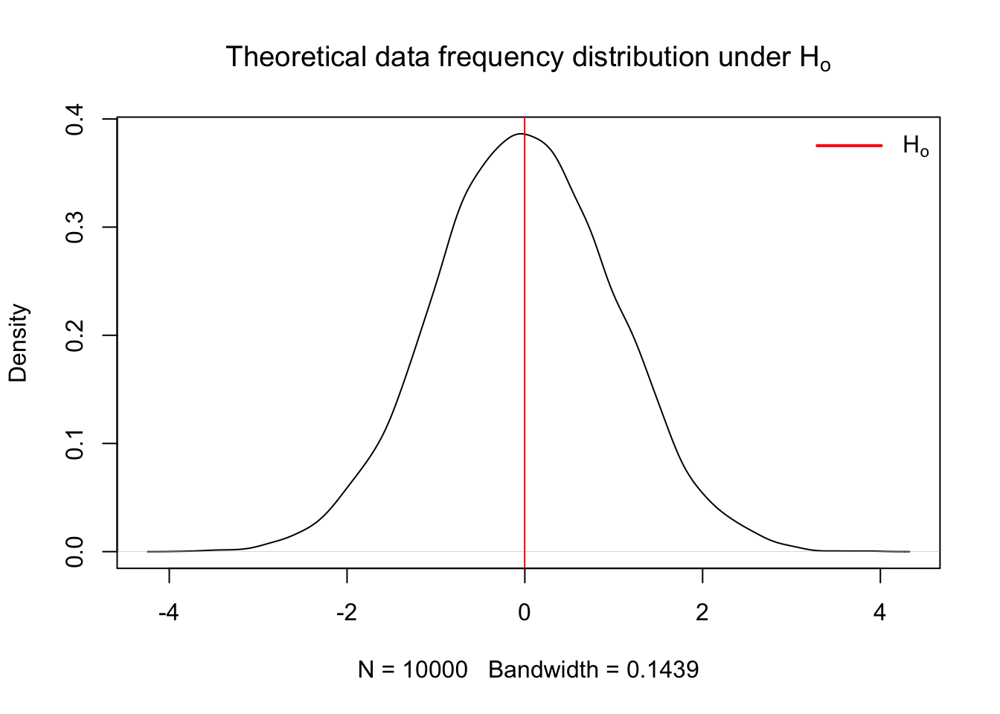
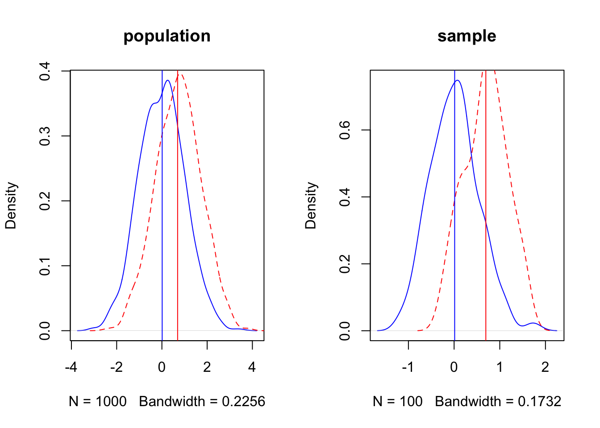

# Standard Statistics

This is the section that most of you will find more familiar as we cover concepts typically considered "classical" statistics. Studying complex systems with high levels of natural variability requires utilization of statistics to infer pattern and causation from data.  

## Fisher  

1. Select an appropriate test
2. Set up a null hypothesis $H_o$
3. Calculate the theoretical probability of the results under $H_o$
4. Assess the statistical significance of the results
5. Interpret the statistical significance of the results.


1. The appropriate test 

After selecting an appropriate test, it is important to define the null hypothesis and select the appropriate tests [@fisherInverseProbabilityUse1932]. 

2. Set up the null hypothesis $H_o$. The $H_o$ derives naturally from the test selected. An example would be the comparison of two population central values (e.g. $M_1 - M_2 = 0$) or more comparatively $M_1 ≠ 0$. 

Some parameters of the distribution are calculated from the sample i.e. variance and degress of freedom
The rest of the parameters are estimated according to the theoretical distribution.

3. Calculate theoretical probability of results under the $H_o$ hypothesis
Here is an example of the frequency distribution for data operating under the assumption that $H_o$ is true


``` r
x = rnorm(10000, mean = 0, sd = 1)
x.den = density(x)

{
  plot(x.den, main = expression("Theoretical data frequency distribution under H"[o]))
  abline(v = mean(x), col = 'red')
  legend("topright", 
       legend = expression(H[o]),
       col = c("red"), 
       border = NA,
       lty = 1, 
       lwd = 2,
       seg.len = 3,
       bty = "n")
}
```



4. Assess significance of results

Fisher proposed tests of significance that were based on identifying results with low probability of occuring under the null hypothesis [@perezgonzalezFisherNeymanPearsonNHST2015]. A research result with a low p-value, i.e. a low probability of occuring under the theoretrical distribution of the null hypothesis, may be taken as evidence against the null hypothesis. [@perezgonzalezFisherNeymanPearsonNHST2015]. How small of a result may be considered significant is the pervue of the researcher [@fisherDesignExperiments1960; @perezgonzalezFisherNeymanPearsonNHST2015] or the reader, which is why reporting test statistics and p-values are important. If the p-value is equal to or smaller than the chosen significance level, the results are taken as evidence against the null hypothesis and deemed significant.

5. Interpretation of the results

A significant result is representative of a dual statement. Either a rare result that occurs only with a probability of p, or lower, just happened, or the null hypothesis failed to explain the datum collected by the research. A literal intrepretation of the results is that the null hypothesis did not explain our data, thus we infered other processes.


``` r
x = rnorm(10000, mean = 0, sd = 1)
x.den = density(x)
# Compute the 95th percentile
q95 = quantile(x, 0.95)
# Identify the portion of the density curve above the 95th percentile
x.shade = x.den$x[x.den$x >= q95]
y.shade = x.den$y[x.den$x >= q95]

{
  plot(x.den, main = expression("Theoretical data frequency distribution under H"[o]))
  abline(v = mean(x), col = 'red')
  # Add shaded polygon for upper 5%
  polygon(c(q95, x.shade, max(x.shade)), 
        c(0, y.shade, 0), 
        col = 'pink', 
        border = NA)
    legend("topright", 
       legend = c(expression(H[o]), '5% rejection region'),
       col = c("red", 'pink'), 
       border = NA,
       lty = 1, 
       lwd = 2,
       seg.len = 3,
       bty = "n")
}
```


## Neyman-Pearson


``` r
set.seed(3)
d = 0.75

par(mfrow = c(1,2))
p1 = rnorm(1000, mean = 0, sd = 1)
p2 = rnorm(1000, mean = d, sd = 1)

p1.den = density(p1)
p2.den = density(p2)

xo = rnorm(100, mean=0, sd=0.5)
xa = rnorm(100, mean = d, sd = 0.5)

xo.den = density(xo)
xa.den = density(xa)

{
  plot(p1.den, col = 'blue', lty = 1, main = 'population')
  lines(p2.den, col = 'red', lty = 2)
  abline(v = c(mean(xo), mean(xa)), col = c('blue','red'))
  
  plot(xo.den, col = 'blue', lty = 1, main = 'sample')
  lines(xa.den, col = 'red', lty = 2)
  abline(v = c(mean(xo), mean(xa)), col = c('blue','red'))
}
```



## Null Hypothesis Testing   

Null Hypothesis Significance Testing has been extensively used to make inference and test hypothesis [@stephensInferenceEcologyEvolution2007], but has also experienced extensive criticism due to the logical fallacies associated with the assumptions required to make inference regarding test statistics [@hagenPraiseNullHypothesis; @sedgwickTrialsTribulationsTeaching; @wuThereIntrinsicLogical2018]. Whichever side of the fence you fall on, you should be aware of both the arguments for and against the utilization of NHST and by extension **p-values** in making scientific inference. After extensive reading, I will give you my anedotal opionion as of today (09/17/2025) of the issue. Whatever inferential paradigm you choose to use for your research is warranted providing you understand the underlying assumptions the statistical test makes, and exactly what each test statistic is testing [@hagenPraiseNullHypothesis; @wassersteinASAStatementValues2016]. The most common critique of NHST that I have observed is that scientists and statisticians are not trained how to use tests appropriately, resulting in errant results being reported [@hagenPraiseNullHypothesis; @ioannidisWhyMostPublished2005].

The magnitude of statistical tests designed for numerous experimental frameworks lend to the problem. Scientists without formal training in the choice of statistical tests are often highly motivated to find *significant* results, that is, to reject som $H_o$ hypothesis in support of the $H_A$. This motivation is counter to the primary motivation of NHST, which is to reject the $H_o$ with trepidation [@perezgonzalezFisherNeymanPearsonNHST2015]. This encourages researchers to go in search of *significant* results by utilizing any number of seemingly plausible available methods to obtain results which we find either either interesting, plausible, personally gratifying, or worse, important for the success of our career. However, whether made through ignorance or malice, that fact that we may report erroneous research results, and that most research results which we may build our research careers on are false [@ioannidisWhyMostPublished2005], should give us at least momentary pause. 

Due to the magnitude of potential scientific tests, which fill tomes of literature and giant volumes of books, teaching standardized statistics which seek to make inference of population central values and affirm or nullify $H_o$ is extremely difficult task to undertake in the limited time we have here. Add in the conflation of **posterior** and **apriori** tests, and the conflation of the two, along with nonparametric and parametric tests, creating a clear picture of statistical analysis becomes difficult. So what should we do? I believe the answer rests in the application of two first principles. The first is to hold yourself to the highest set of moral ideals, seeking to reinforce your research findings through severe critique of the results by testing their endurance through multiple tests and alignment with quality research [@mayoStatisticalInferenceSevere2018]. Secondly and of equal importance is to put in serious effort to read and understand the machinery of statistical tests and their underlying assumptions to ensure that the hypothesis you're testing is the inference they are making [@wuThereIntrinsicLogical2018]. 

### Population central values

Making inference about a population is the foundation of beginning a good statistical analysis, and often starts in the exploratory analysis we began to explore in chapter 2. A population takes on numerical descriptive values known as parameters. Typical parameters of a population is the *mean* ($u$), *median* (*M*), standard deviation ($σ$), and proportion ($π$) [@ottStatisticalMethodsData2016]. For the purposes of hypothesis testing, we will make inference of these parameters in one of two ways. First is to *estimate* the value of the population, or we will *test a hypothesis*. The 95% confidence interval is the calculated interval over which 95% of the data will fall given a normal distribution around the central value, $u$ in this case. The 95% confidence interval can be retrieved using the **quantile** function in R, or calculated using the equation of $u ± 1.96σ/√n$.

Here is an example of creating a population with known values of:

N 10000 population size
mean of 0
standard deviation of 1


``` r
n = 10000 # Population size
u = 0 # population mean or central value
sd = 1 # Standard deviation
x = rnorm(100000, mean = u, sd = sd)
x.den = density(x)

# 95% confidence interval time
q0.025 = quantile(x, 0.025)
q0.975 = quantile(x, 0.975)

# Identify x-values within the 95% CI
x.ci <- x.den$x[x.den$x >= q0.025 & x.den$x <= q0.975]
y.ci <- x.den$y[x.den$x >= q0.025 & x.den$x <= q0.975]
# Identify the portion of the density curve above the 97.5th percentile
x.upper = x.den$x[x.den$x >= q0.975]
y.upper = x.den$y[x.den$x >= q0.975]
# Identify the portion of the density curve below the 0.025th percentile
x.lower = x.den$x[x.den$x <= q0.025]
y.lower = x.den$y[x.den$x <= q0.025]

{
  plot(x.den, main = 'Distribution and rejection regions for normal distribution')
  # Add shaded polygon for 95% CI
  polygon(c(x.ci[1], x.ci, x.ci[length(x.ci)]),
        c(0, y.ci, 0),
        col = 'lightblue', border = NA)
  polygon(c(x.upper[1], x.upper, x.upper[length(x.upper)]),
        c(0, y.upper, 0),
        col = 'pink', border = NA)
  polygon(c(x.lower[1], x.lower, x.lower[length(x.lower)]),
        c(0, y.lower, 0),
        col = 'pink', border = NA)
  abline(v = c(mean(x)-sd(x),mean(x), mean(x)+sd(x)), col = c('blue','red','blue'))
  
legend("topright", 
       legend = c('mean','standard deviation', '95% CI','Critical regions'),
       col = c("red",'blue',NA), 
       fill = c(NA,NA,'lightblue','pink'),
       border = NA,
       lty = c(1,1,NA,NA), 
       lwd = c(2,2,NA,NA),
       seg.len = 3,
       bty = "n")
}
```


Now lets do that in one of our example datasets.


``` r
library(qthink)
data("bodyweight")
x = bodyweight$BW0
x.den = density(x)

# 95% confidence interval time
q0.025 = quantile(x, 0.025)
q0.975 = quantile(x, 0.975)

# Identify x-values within the 95% CI
x.ci <- x.den$x[x.den$x >= q0.025 & x.den$x <= q0.975]
y.ci <- x.den$y[x.den$x >= q0.025 & x.den$x <= q0.975]
# Identify the portion of the density curve above the 97.5th percentile
x.upper = x.den$x[x.den$x >= q0.975]
y.upper = x.den$y[x.den$x >= q0.975]
# Identify the portion of the density curve below the 0.025th percentile
x.lower = x.den$x[x.den$x <= q0.025]
y.lower = x.den$y[x.den$x <= q0.025]

par(mfrow = c(1,2))

{
  hist(x)
  plot(x.den)
  # Add shaded polygon for 95% CI
  polygon(c(x.ci[1], x.ci, x.ci[length(x.ci)]),
        c(0, y.ci, 0),
        col = 'lightblue', border = NA)
    polygon(c(x.upper[1], x.upper, x.upper[length(x.upper)]),
        c(0, y.upper, 0),
        col = 'pink', border = NA)
  polygon(c(x.lower[1], x.lower, x.lower[length(x.lower)]),
        c(0, y.lower, 0),
        col = 'pink', border = NA)
  abline(v = c(mean(x)-sd(x),mean(x), mean(x)+sd(x)), col = c('blue','red','blue'))
# legend("topright", 
#        legend = c('mean','standard deviation', '95% CI'),
#        col = c("red",'blue',NA), 
#        fill = c(NA,NA,'lightblue'),
#        border = NA,
#        lty = c(1,1,NA), 
#        lwd = c(2,2,NA),
#        seg.len = 1,
#        bty = "n")
}
```


Here we see a the same values of our population of bodyweights on day 0 from our heifers. Note how they do not follow the neat normal distribution, but do approximate it closely enough, at least visually. Here arises one of the first critiques of NHST that all tests assume that the population distribution follows a normal bell curve if enough samples are taken. 

#### Statistical test for u {-}

Lets suppose that we have another sample of heifers, perhaps the next years. (keep in mind that at this point we are not considering any treatment options, the only comparison is a made up central value, mean, compared to the current central mean of the current population). See below for the code if you're not following.


``` r
n = length(unique(bodyweight$VID))
uo = mean(bodyweight$BW0) # Mean from previous measurements
u = 490 # Our new made up mean
sd = sd(bodyweight$BW0) # our estimation of bodyweight based upon previous data
```

We choose a critical value of 0.05 to serve as our indicator of significance, i.e. a p value of <= 0.05 is considered significant. This translates to a any value greater than 1.96 standard deviations from the $H_o$ mean is considered significant. This can be mathematically calculated using the equation $z = (\bar{y} - u_o)/ (\sigma / \sqrt n)$ and takes on the following calculation in code.


``` r
z = (u - uo)/(sd/sqrt(n))
z
```

```
## [1] 2.911734
```

So here we see that our new (made up) test statistic is 2.9117336 above the central value of the population of heifers on day zero in the current dataset. This can be graphically described, demonstrated as follows.


``` r
xo = rnorm(n = n, mean = uo, sd = sd)
xo.den = density(xo)

# Critical quantile
q95 = 1.96*(sd/sqrt(n)) + uo

# Identify x-values within the 95% CI
x.ci = xo.den$x[xo.den$x <= q95]
y.ci = xo.den$y[xo.den$x <= q95]

# Right tail: x > q975
x.upper = xo.den$x[xo.den$x >= q95]
y.upper = xo.den$y[xo.den$x >= q95]

{
  plot(xo.den)
  # Add shaded polygon for 95% CI
  polygon(c(x.ci[1], x.ci, x.ci[length(x.ci)]),
        c(0, y.ci, 0),
        col = 'lightblue', border = NA)

  # Shade right rejection region
  polygon(c(x.upper[1], x.upper, x.upper[length(x.upper)]),
          c(0, y.upper, 0),
          col = 'salmon', border = NA)
  abline(v = c(uo, u), col = c('black', 'blue'), lty = c(1,2), lwd = c(2,2))
  
legend("topright",
       legend = c(expression('H'[o]), expression('H'[a])),
       col = c("black",'blue'),
       border = NA,
       lty = c(1,2),
       lwd = c(2,2),
       seg.len = 3,
       bty = "n")
}
```


Here we calculated the rejection region for the distribution constructed under $H_o$ and then observed where our new mean fell. Since it fell in the rejection region, we can assume that it was not constructed under the same theoretical process used to construct the $H_o$ distribution, and thus we can reject it. However, those processes may look similar, and we can see that by sampling observations from each of the $H_o$ and $H_a$ theoretical processes we just compared above and plotting them graphically.


``` r
set.seed(1)
x = rnorm(100, mean = uo, sd = sd)
xo = rnorm(100, mean = u, sd = sd)
t.test(x)
```

```
## 
## 	One Sample t-test
## 
## data:  x
## t = 119.85, df = 99, p-value < 2.2e-16
## alternative hypothesis: true mean is not equal to 0
## 95 percent confidence interval:
##  472.2023 488.1008
## sample estimates:
## mean of x 
##  480.1516
```

``` r
x.den = density(x)
x0.den = density(xo)
f = ecdf(xo)
f(0)
```

```
## [1] 0
```

``` r
{
  plot(x0.den, main = '', col = 'lightblue')
  lines(x.den, col = 'red')
  abline(v = c(uo,u), col = c('lightblue','red'), lty = 1)
  legend("topright", legend = c(expression(H[0]), expression(H[a])), col = c('lightblue','red'), lty = 1, lwd = 2, bty = "n")
}
```


#### Two population inference  

A statistical test is based upon the concept of the following five parts [@ottStatisticalMethodsData2016]:

1. Resaerch hypothesis $H_a$
2. Null hypothesis $H_o$
3. Test statistic
4. Rejection region
5. Check assumptions, draw conclusions 


``` r
# Sample data
xo = rnorm(100, mean = 320, sd = 10)
xa = rnorm(100, mean = 350, sd = 10) 

t.test(xo, xa, var.equal = T)
```

```
## 
## 	Two Sample t-test
## 
## data:  xo and xa
## t = -21.09, df = 198, p-value < 2.2e-16
## alternative hypothesis: true difference in means is not equal to 0
## 95 percent confidence interval:
##  -33.04493 -27.39363
## sample estimates:
## mean of x mean of y 
##  320.2967  350.5160
```

``` r
# Compute density
xo.den = density(xo)
xa.den = density(xa) 

{
# Plot density
plot(xo.den,
     xlim = c(min(xo), max(xa)),
     ylim = c(0, max(max(xo.den$y), max(xa.den$y))),
     main = "", ylab = expression(f(x)))
lines(xa.den, col = 'red')

# # Shade upper 5%
# xo.vals <- xo.den$x[xo.den$x >= q95]
# yo.vals <- xo.den$y[xo.den$x >= q95]
# 
# polygon(c(q95, xo.vals, max(xo.vals)), 
#         c(0, yo.vals, 0), 
#         col = "pink", 
#         border = NA)
}
```


``` r
# Add a vertical line at the 95th percentile
# abline(v = q95, col = "red", lty = 2)
```

#### Sample size {-}

This begs the question, how many samples are necessary to make inference of a populations central value? Here lies one of the first critiques of NHST, as we must assume that the overall greater population follows some known distribution, in this case, a normal distribution, and that we are sampling from that population. However, the greater population is actually unknowable outside of simply measuring the entire population. Samples are expensive, so at some point we have to simply accept that we have sampled *enough*, which is to say done our due diligence to collect an adequate representation of the greater population so we can make inference from it. Below we can show mathematically how many samples are required. The goal of sampling is to create a credible interval which has a given chance of containing $u$, or the population mean. This reasonable level of certainty is typically set at 90-95% due to tradition. However, this runs two risks. 1) 95% levels of confidence means you run a 1 in 20 chance of not capturing the population mean. Equate this to having a 20 round magazine clip loaded into a gun that you are taking on a camping trip to the Little Bighorns in Wyoming for protection against Grizzly bears, in which 1 of the 20 bullets is a blank. Is this a risk you ar willing to take? The second risk is the inverse of the first, which is that this may be an unreasonble and arbritarily high level of confidence that would reduce the percieved validity of aquired data, particularly if the data is novel, but funds or circumstances meant obtaining enough samples to obtain this level of confidence was not possible, and thus the research was not conducted or the findings not reported.

The formula is as follows:  
$n = (z_σ/2)^2^ σ^2^ / E^2^$

and in code for the heifer bodyweight on day 0
Because the heifers range from 376.5125186, 582.4143309, the typical assumption to approximate the population $σ$ is to take 51.4754531, and we might arbritrarily choose our accuracy to be 25 lbs.

``` r
x = bodyweight$BW0
sigma = diff(range(x))/4
E = 25
n = (1.96^2 * sigma^2)/E^2
n
```

```
## [1] 28.8412
```

So, from this we can interpret that in order to quantify the central limit ($u$), of the population of heifers within 25 lbs with 95% confidence, we need 28 heifers. Now note how this changes as we tighten our accuracy levels.


``` r
E = seq(50,1,-1)
sigma = diff(range(x))/4
n = c()
for (i in E) {
 n[i] = (1.96^2 * sigma^2)/E[i]^2
}

{
  par(mfrow = c(1,2))
  plot(E,n, type = 'n')
  points(E,n)
  lines(E,n, col = 'blue', lwd = 2)
  
  plot(E,n, xlim = c(5,length(E)), ylim = c(0,500))
  lines(E,n, col = 'blue')
}
```


So we see that the desired level of accuracy of our measurement is directly related to the number of samples we have to take. 
The other parameter, which I would remind you we are making using prior assumptions, is the natural variation which exists in the greater population. How does that vary our sample size at a given level of accuracy?


``` r
E = 25 # accuracy level
sigma = seq(1,100,1)
n = c()
for (i in 1:length(sigma)) {
 n[i] = (1.96^2 * sigma[i]^2)/E^2
}

{
  plot(sigma,n, type = 'n')
  points(sigma,n)
  lines(sigma,n, col = 'blue', lwd = 2)
}
```


So here we see that holding accuracy constant and varying the theorized population variance, we dramatically impact the required number of samples we have to take.

## Linear Models  

Next we embark into linear models, our first cause and effect models. These are extremely powerful statistical tools that are frequently used in science, as they provide information regarding the functional relationship between the response (dependent) and explanatory (independent variables) [@ottStatisticalMethodsData2016]. 

Regression models have a number of applications:

1. Provides a major description of features within the dataset.
2. Provides estimates of the response of values not tested that are intermediary to values tested
3. Provides a mathematical tool to predict the future
4. Shows relationship between cheap to measure variables and expensive to measure variables

### Prediction vs. explanation  

It is important to note the difference between explaining the difference between **Prediction** vs. **Explanation**. Prediction makes reference to predicting future values, while explanation focuses on understanding relationships within the current dataset. While the architecture of the models are identical, the thought and process of building them is different. Building explanatory models is easier, as the model is built with the same data it is designed to predict. Prediction is by nature more difficult.

**It is important to note that the term "prediction" is used in both instances.**

### Simple Linear Models

A simple causal linear model takes the form of $y = \beta_0 + \beta_1x_1$, where $y$ represents the dependent variable, $\beta_0$ is the y intercept of the value of y when x = 0, and $\beta_1$ is the slope of the line. 

The **assumption of linearity** means that we assume the *slope of the line doesn't change as x changes*.

This is demonstrated below.


``` r
{
fun1 = function(x,b0,b1){y = b0 + x*b1}

days = seq(1,45,1) # Days in a feeding trial
initialweight = 300 # Initial bodyweight
gain = 0.75 # Average Daily Gain, Kgs per day
weight = fun1(days, b0 = initialweight, b1 = gain) # Equation for what the animal weighs on each day through the trial
plot(days,weight, ylim = c(275,375), main = expression(y == beta[0] + beta[1]*x))
abline(lm(weight~days), col = 'blue')
}
```


However, this leaves no room for variation, or stoichasticity, in the relationship. And as we will recall from class, one of the *Fundamental principles of statistics is to handle variation* in data and causal relationship models. Below is an example of a projected linear growth in BW model with simulated normal varation added into the relationship.


``` r
fun1 = function(x,b0,b1,e){y = b0 + x*b1 + e}

days = seq(1,45,1) # Days in a feeding trial
initialweight = 300 # Initial bodyweight
gain = 0.75 # Average Daily Gain, Kgs per day
variance = rnorm(n = length(days), mean = 0, sd = 10)
weight = fun1(x = days,b0 = initialweight, b1 = gain, e = variance) # Equation for what the animal weighs on each day through the trial
par(mfrow = c(1,2))

{
plot(days,weight, ylim = c(275,375), main = expression(y == beta[0] + beta[1]*x + epsilon))
abline(lm(weight~days), col = 'blue')
}
{
hist(variance)
rug(variance, col = 'blue')
}
```


The above data is an example of relationships with regularly spaced data collected on the x interval. However, this is not always necessary. Consider the same simulated growth plot below, where the only difference is adding another opportunity for variation along the x axis. 


``` r
fun1 = function(x,b0,b1,e){y = b0 + x*b1 + e}
days = round(runif(100, min = 0,max = 45))
hist(days)
```


``` r
initialweight = 300 # Initial bodyweight
gain = 0.75 # Average Daily Gain, Kgs per day
variance = rnorm(n = length(days), mean = 0, sd = 10)
weight = fun1(x = days,b0 = initialweight, b1 = gain, e = variance) # Equation for what the animal weighs on each day through the trial
par(mfrow = c(1,2))

{
plot(days,weight, ylim = c(275,375), main = expression(y == beta[0] + beta[1]*x + epsilon))
abline(lm(weight~days), col = 'blue')
}
{
hist(variance)
rug(variance, col = 'blue')
}
```


This simulation represents the type of data we might see when using precision livestock technology such as smartscales. We have randomly created a sequence of days ranging from day 1 to day 45, where the animal may visit between 1 to an *infinite* number of times. Note how if you copy and paste this code, that the number of visits per day, the length of bodyweights recorded, changes each time you run it. Yet, we are still able to fit the same linear regression model? This is perfectly acceptable.

Next lets use base R functions to fit a linear regression model to the data. The software will identify the line of best fit by minimizing the prediction error of the residuals, the distance between each observed data point and the regression line, using a method called the **least squares prediction method**.


``` r
weight.lm = lm(weight~days) # Create linear regression model and assign it to object weight.lm
weight.lm
```

```
## 
## Call:
## lm(formula = weight ~ days)
## 
## Coefficients:
## (Intercept)         days  
##    297.9039       0.8194
```

``` r
summary(weight.lm)
```

```
## 
## Call:
## lm(formula = weight ~ days)
## 
## Residuals:
##     Min      1Q  Median      3Q     Max 
## -23.397  -6.246  -0.173   7.296  20.956 
## 
## Coefficients:
##              Estimate Std. Error t value Pr(>|t|)    
## (Intercept) 297.90390    1.70490  174.73   <2e-16 ***
## days          0.81945    0.06761   12.12   <2e-16 ***
## ---
## Signif. codes:  0 '***' 0.001 '**' 0.01 '*' 0.05 '.' 0.1 ' ' 1
## 
## Residual standard error: 9.678 on 98 degrees of freedom
## Multiple R-squared:  0.5998,	Adjusted R-squared:  0.5957 
## F-statistic: 146.9 on 1 and 98 DF,  p-value: < 2.2e-16
```

``` r
plot(weight.lm)
```


Because the simulated data was constructed to satisfy all the assumptions of simple linear models, i.e. linearity, normality of the residuals etc, the resulting plots from the simple linear model are ideal. But what would they look like if we introduce non-normal variance to the residuals? Lets plot it and find out. 


``` r
fun1 = function(x,b0,b1,e){y = b0 + x*b1 + e}
days = round(runif(100, min = 0,max = 45))
hist(days)
```


``` r
initialweight = 300 # Initial bodyweight
gain = 0.75 # Average Daily Gain, Kgs per day
variance = rnorm(n = length(days), mean = 0, sd = 10) # normal variance
variance = exp(variance) - mean(exp(variance))  # apply a skewing scalar to the variance
variance = variance/sd(variance) * 10 # Standardize and multiply to achieve desired SD
weight = fun1(x = days,b0 = initialweight, b1 = gain, e = variance) # Equation for what the animal weighs on each day through the trial
par(mfrow = c(1,2))

{
plot(days,weight, main = expression(y == beta[0] + beta[1]*x + epsilon))
abline(lm(weight~days), col = 'blue')
hist(variance)
rug(variance, col = 'blue')
}
```


``` r
weight.lm = lm(weight~days) # Create linear regression model and assign it to object weight.lm
weight.lm
```

```
## 
## Call:
## lm(formula = weight ~ days)
## 
## Coefficients:
## (Intercept)         days  
##     300.136        0.744
```

``` r
summary(weight.lm)
```

```
## 
## Call:
## lm(formula = weight ~ days)
## 
## Residuals:
##    Min     1Q Median     3Q    Max 
## -1.304 -1.226 -1.151 -1.088 98.307 
## 
## Coefficients:
##              Estimate Std. Error t value Pr(>|t|)    
## (Intercept) 300.13618    1.96989 152.362   <2e-16 ***
## days          0.74401    0.07457   9.977   <2e-16 ***
## ---
## Signif. codes:  0 '***' 0.001 '**' 0.01 '*' 0.05 '.' 0.1 ' ' 1
## 
## Residual standard error: 10.05 on 98 degrees of freedom
## Multiple R-squared:  0.5039,	Adjusted R-squared:  0.4989 
## F-statistic: 99.55 on 1 and 98 DF,  p-value: < 2.2e-16
```

``` r
plot(weight.lm)
```


Here I have used the exponential of the variation to create a residual structure artificaially skewed to the right. Note the changes in the QQ plots and the structure of the residuals.


#### Example Simple Linear Model {-}
Finally, lets apply this to our toy datasets. 


``` r
# Libraries ----
library(tidyverse) # Graphing 
```

```
## ── Attaching core tidyverse packages ──────────────────────── tidyverse 2.0.0 ──
## ✔ dplyr     1.1.4     ✔ readr     2.1.5
## ✔ forcats   1.0.0     ✔ stringr   1.5.1
## ✔ ggplot2   3.5.2     ✔ tibble    3.2.1
## ✔ lubridate 1.9.4     ✔ tidyr     1.3.1
## ✔ purrr     1.0.4     
## ── Conflicts ────────────────────────────────────────── tidyverse_conflicts() ──
## ✖ dplyr::filter() masks stats::filter()
## ✖ dplyr::lag()    masks stats::lag()
## ℹ Use the conflicted package (<http://conflicted.r-lib.org/>) to force all conflicts to become errors
```

``` r
library(data.table) # Reading data and manipulating data
```

```
## 
## Attaching package: 'data.table'
## 
## The following objects are masked from 'package:lubridate':
## 
##     hour, isoweek, mday, minute, month, quarter, second, wday, week,
##     yday, year
## 
## The following objects are masked from 'package:dplyr':
## 
##     between, first, last
## 
## The following object is masked from 'package:purrr':
## 
##     transpose
```

``` r
library(readxl) # Reading excel
library(qthink)

# Data
data("bodyweight")
# head(bodyweight)
d.bw = melt.data.table(data = bodyweight, measure.vars = c(5:16), value.name = 'BW', variable.name = 'name')
d.bw$Day = parse_number(as.character(d.bw$name))

# Data wrangling

days = seq(min(d.bw$Day), max(d.bw$Day), by = 1)### Assign day 
days = days[days >= 0]
days
```

```
##  [1]  0  1  2  3  4  5  6  7  8  9 10 11 12 13 14 15 16 17 18 19 20 21 22 23 24
## [26] 25 26 27 28 29 30 31 32 33 34 35 36 37 38 39 40 41 42 43 44 45 46 47 48 49
## [51] 50 51 52 53 54 55 56 57 58 59 60 61 62 63 64 65 66 67 68 69 70
```

``` r
d.days = data.table(Day = days)
VIDs = data.table(VID = unique(d.bw$VID)) # Get list of unique animals
d.daysvid = merge(days, VIDs, by = NULL) %>%  # Create a table with one animal per day observation
  as.data.table
names(d.daysvid) = c('Day','VID') # Assign names to the table

names(d.days)
```

```
## [1] "Day"
```

``` r
d.bw2 = merge.data.table(d.daysvid, d.bw, by = c('VID','Day'), all = T) # merge bodyweight with our days vid table.

# Run Linear Regression model
lm.bw = lm(BW ~ Day, data = d.bw2)
summary(lm.bw)
```

```
## 
## Call:
## lm(formula = BW ~ Day, data = d.bw2)
## 
## Residuals:
##      Min       1Q   Median       3Q      Max 
## -179.964  -34.337    0.374   36.372  216.971 
## 
## Coefficients:
##              Estimate Std. Error t value Pr(>|t|)    
## (Intercept) 477.28860    2.43741  195.82   <2e-16 ***
## Day           1.63822    0.06541   25.04   <2e-16 ***
## ---
## Signif. codes:  0 '***' 0.001 '**' 0.01 '*' 0.05 '.' 0.1 ' ' 1
## 
## Residual standard error: 58.27 on 934 degrees of freedom
##   (4758 observations deleted due to missingness)
## Multiple R-squared:  0.4017,	Adjusted R-squared:  0.4011 
## F-statistic: 627.2 on 1 and 934 DF,  p-value: < 2.2e-16
```

### Simple Anovas

At their core, Analysis of Variance Analysises are linear models which use categorical independent variables. Some books teach ANOVAs separately from linear models, preferring instead to refer to them as "describing differences amongst populations" [@ottStatisticalMethodsData2016]. However, I do not find this method useful as ANOVAs are ran automatically when the lm function is called with categorical independent variables. Thus, I am going to include them here in the discussion on linear models, with the understanding that the math does change somewhat. This also allows me the opportunity to demonstrate that it is sometimes possible to run independent variables as either categorical or continuous, and doing so can be a product component of the exploratory data process.


Here I simulate a series of datum demonstrative of data which may be analyzed using an ANOVA.

``` r
# Create a data table with multiple variables
d = data.table(t1 = rnorm(100, mean = 150, sd = 50),
               t2 = rnorm(100, mean = 200, sd = 30),
               t3 = rnorm(100, mean = 250, sd = 75))
d2 = melt.data.table(data = d, measure.vars = c(1:3)) # Melt the data into long format

d2 %>% 
  ggplot(aes(x = variable, y = value, fill = variable))+
  geom_boxplot()
```


``` r
aov.mod = aov(value ~ variable, data = d2)
summary(aov.mod)
```

```
##              Df  Sum Sq Mean Sq F value Pr(>F)    
## variable      2  443650  221825   63.98 <2e-16 ***
## Residuals   297 1029792    3467                   
## ---
## Signif. codes:  0 '***' 0.001 '**' 0.01 '*' 0.05 '.' 0.1 ' ' 1
```

``` r
coef(aov.mod)
```

```
## (Intercept)  variablet2  variablet3 
##   151.81016    48.28339    94.18654
```

``` r
plot(aov.mod)
```


Just to prove my point, look at the values collected from the ANOVA analysis ran above, and compare to the lm model ran below.


``` r
lm.mod = lm(value ~ variable, data = d2)
summary(lm.mod)
```

```
## 
## Call:
## lm(formula = value ~ variable, data = d2)
## 
## Residuals:
##      Min       1Q   Median       3Q      Max 
## -220.768  -31.893    3.146   36.768  172.895 
## 
## Coefficients:
##             Estimate Std. Error t value Pr(>|t|)    
## (Intercept)  151.810      5.888  25.781  < 2e-16 ***
## variablet2    48.283      8.327   5.798 1.71e-08 ***
## variablet3    94.187      8.327  11.310  < 2e-16 ***
## ---
## Signif. codes:  0 '***' 0.001 '**' 0.01 '*' 0.05 '.' 0.1 ' ' 1
## 
## Residual standard error: 58.88 on 297 degrees of freedom
## Multiple R-squared:  0.3011,	Adjusted R-squared:  0.2964 
## F-statistic: 63.98 on 2 and 297 DF,  p-value: < 2.2e-16
```

``` r
anova(lm.mod)
```

```
## Analysis of Variance Table
## 
## Response: value
##            Df  Sum Sq Mean Sq F value    Pr(>F)    
## variable    2  443650  221825  63.976 < 2.2e-16 ***
## Residuals 297 1029792    3467                      
## ---
## Signif. codes:  0 '***' 0.001 '**' 0.01 '*' 0.05 '.' 0.1 ' ' 1
```

* What do you notice about the results from the outputs of both methods? 
* How do the central population estimates compare to the estimates we simulated in our datasets?
* What can we conclude about the differences in our population level (categorical or treatment) means?

The most important statistic in an ANOVA table is the **F Statistic*. The F statistic informs us if the *within sample* variation is greater than the *between sample* variation. if the variability among the sample means is large compared to the *within sample* means, we are more apt to conclude that there is a difference. Alternatively, if the *between sample* variation is small compared to the *within sample* varation, we are less likely to conclude that there is a difference.

Use the code above to create an example with and without a significant F value.

#### Example ANOVA {-}

Lets use the above body-weight data to demonstrate how we might use an ANOVA to analys the same data in a categorical format that we just analysed in a linear model format by changing the type of data in the "day" column to characher.


``` r
d.bw$Day = as.character(d.bw$Day)
d.bw %>% 
  ggplot(aes(x=Day, y = BW, fill = Day))+
  geom_boxplot()
```


``` r
aov.bw = aov(BW ~ Day, data = d.bw)
summary(aov.bw)
```

```
##              Df  Sum Sq Mean Sq F value Pr(>F)    
## Day          11 2344205  213110   66.59 <2e-16 ***
## Residuals   924 2957213    3200                   
## ---
## Signif. codes:  0 '***' 0.001 '**' 0.01 '*' 0.05 '.' 0.1 ' ' 1
```

``` r
coef(aov.bw)
```

```
## (Intercept)      Day-42        Day0       Day14       Day21       Day28 
##   495.57692   -66.26923   -20.28205   -16.67949    12.01282    11.65385 
##       Day35       Day42       Day49       Day56        Day7       Day70 
##    36.87179    46.88462    61.73077    83.78205   -30.70513   118.60256
```

``` r
plot(aov.bw)
```


How do these results look compared to the results from the linear model? How are they similar? How are they different? What assumption is being made about the independent variable here that is not being accounted for that is be accounted for in the linear regression model above using time as a continuous value?

## Demonstrating Equivalence

 I do have some concerns with the message that is conveyed by the title and approach taken in the statistical methods. Specifically, remember the definition of a p-value is “the probability of obtaining a value of the test statistic that is as likely or more likely to reject the null hypothesis (H0) as the actual observed value of the test statistic, assuming the null hypothesis is true.” The null hypothesis tested by a general linear mixed effects model for your study is generally “Newly weaned calves limit fed a high concentrate diet perform does not alter growth, performance, and efficiency compared to calves fed an ad libitum forage based diet”,  with H0: ALF = LFC and HA: ALF ≠ LFC. A high p-value in this instance indicates a failure to reject the null hypothesis. No matter how large the p-value may be, it does not provide support for the null hypothesis. Failure to reject the null hypothesis means one must now become concerned with the power, or n, of the study, and then move forward to show sufficient effort was made to demonstrate equivalence, or conversely find differences, between treatments.  This is typically illustrated by determining an acceptable delta, (difference between treatment) and then conducting a power analysis to show how many animals would be required to obtain a significant p-value at that acceptable delta given the variation in the system.
 
If this is unnecessarily restrictive or feels difficult to communicate, more studies are moving towards a more Bayesian type of approach, which allows you to specify the prior distribution of the effect size (informed by what is biologically or economically relevant) and then calculate the likelihood of observing no meaningful effect. 


## Liklihood vs. Probability
(inspired by the following [medium article](https://medium.com/@wl8380/probability-vs-likelihood-the-most-misunderstood-duo-in-data-science-759fc4dcb730))


