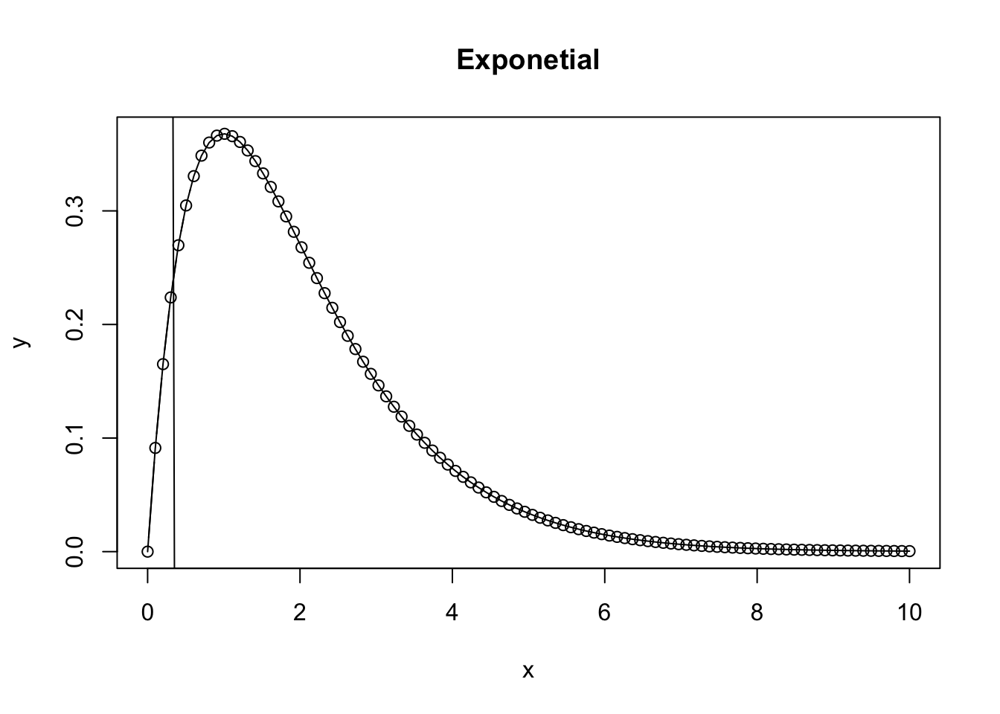

# Developing and Modeling Hypothesis  

Deterministic Functions: Understanding function shape, pattern, and meaning of parameters

## Research Objective
The research objective is critical to identifying the *Conceptual* and the *Specific* question.

Evaluate the effects of Yeast supplementation during pre-weaning and(or) post-weaning periods on performance (growth, intake, feed efficiency), physiologic (e.g., rumen temperature, cortisol, haptoglobin), behavioral, and immunologic responses in newly arrived beef calves.


## Plotting deterministic functions
### Linear Model
#### First order quadratic model
R provides the power to consider unique equations and easily see how they describe the relationships between variables. Understanding what the parameters of various functions mean is critical to allow you to estimate what values may take on when looking at the data. However, there is also value in seeing how to create a controlled system that follows a specified pattern, and then assess how consistently the chosen models explain the data. Consider the linear model, which takes the form of $y=\beta_{o} + \beta_1x + \epsilon$; where $y$ is the dependent variable $\beta_o$ is the intercept on the *Y* axis, $\beta_1$ is the  slope of the $x$ parameter along the *X* axis, and $\epsilon$ is the error for each *i*th data point along the regression line. 


``` r
x = seq(1,12, 1) # Independent X parameter placed on the X axis
b0 = 10 # Specify the Y intercept
b1 = 3 # Specify the B1 coefficient i.e. the slope
y = b0 + b1*x

par(mfrow = c(1,3))
hist(x)
hist(y)
{
plot(x,y, ylim = c(0,max(y)), main = expression(y == beta0 + beta*1*x + epsilon))
abline(lm(y~x), col = 'blue')
}
```


``` r
par(mfrow = c(1,1))
summary(lm(y~x))
```

```
## Warning in summary.lm(lm(y ~ x)): essentially perfect fit: summary may be
## unreliable
```

```
## 
## Call:
## lm(formula = y ~ x)
## 
## Residuals:
##        Min         1Q     Median         3Q        Max 
## -3.727e-15 -1.897e-15 -5.724e-16  8.545e-16  7.789e-15 
## 
## Coefficients:
##              Estimate Std. Error   t value Pr(>|t|)    
## (Intercept) 1.000e+01  1.937e-15 5.163e+15   <2e-16 ***
## x           3.000e+00  2.632e-16 1.140e+16   <2e-16 ***
## ---
## Signif. codes:  0 '***' 0.001 '**' 0.01 '*' 0.05 '.' 0.1 ' ' 1
## 
## Residual standard error: 3.147e-15 on 10 degrees of freedom
## Multiple R-squared:      1,	Adjusted R-squared:      1 
## F-statistic: 1.299e+32 on 1 and 10 DF,  p-value: < 2.2e-16
```
So here we see a basic linear plot derived from data using a deterministic linear model. Next, we will plot the same data, except adding in an element of expected randomness due to some error associated with measuring the data.
#### Second order exponential
A negative exponential function takes on the characteristics of $ae^{bx}$ 

``` r
a = 1
b = 1
x = seq(0,10,length = 100)
y = a*exp(b*x)
plot.new()
{
plot(x,y, type = 'b', main = 'Exponetial')
lines(x, y)
}
```


#### Negative Exponential  
A negative exponential function takes on the characteristics of $ae^{-bx}$ 

``` r
a = 1
b = 0.5
x = seq(0,10,length = 100)
y = a*exp(-b*x)
plot.new()
{
plot(x,y, type = 'b', main = 'Negative Exponetial')
lines(x, y)
}
```


#### Saturating exponential growth function

``` r
a = 1
b = 0.5
x = seq(0,10,length = 100)
y = a*(1-exp(-b*x))
plot.new()
{
plot(x,y, type = 'b', main = 'Saturating Exponential Growth')
lines(x, y)
}
```


#### Ricker Function. 
A Ricker function takes on the characteristics of $axe^{bx}$ 

``` r
a = 2
b = 0.5
x = seq(0,10,length = 100)
y = a*x*exp(-b*x)
plot.new()
{
plot(x,y, type = 'b', main = 'Ricker')
lines(x, y)
}
```


What happens as the Ricker function approaches infinity?


``` r
a = 1
b = 1
x = seq(0,10,length = 100)
y = a*x*exp(-b*x)
plot.new()
{
plot(x,y, type = 'b', main = 'Exponetial')
lines(x, y)
abline(lm(x~y))
}
```



#### Michaelis-Menton Equation
Enzyme subjugation or predator-prey relationships. 

``` r
a = 1
b = 1
x = seq(0,10,length = 100)
summary(x)
```

```
##    Min. 1st Qu.  Median    Mean 3rd Qu.    Max. 
##     0.0     2.5     5.0     5.0     7.5    10.0
```

``` r
y = (a*x)/(b+x)
{
plot(x,y, ylim = c(0,1), type = 'b', main = 'Michaelis-Menton')
lines(x, y)
}
```


#### Logistic Function
The basic logistic function
$$({e^{a+bx}})/({1+e^{a+bx}})$$


``` r
a = 0 # Shifts left to right
b = 1 # Controls inflection point
x = seq(-10,10,length = 100)
summary(x)
```

```
##    Min. 1st Qu.  Median    Mean 3rd Qu.    Max. 
##     -10      -5       0       0       5      10
```

``` r
y = (exp(a+b*x)/(1+exp(a+b*x)))
{
plot(x,y, ylim = c(0,1), type = 'b', main = 'Logistic Function')
lines(x, y)
}
```


## Stoichasticity 

``` r
set.seed(1)
x = runif(n = 100, min = 0, max = 12) # Independent X parameter placed on the X axis
b0 = 10 # Specify the Y intercept
b1 = 3 # Specify the B1 coefficient i.e. the slope
r = rnorm(length(x), mean = 0, sd = 5)
y = b0 + b1*x + r

par(mfrow = c(1,5))
hist(x)
hist(y)
hist(r)
plot(x,y, ylim = c(0,max(y)), main = expression(y == beta*0 + beta*1*x + epsilon))
abline(lm(y~x), col = 'blue')

m = lm(y~x)
hist(residuals(m))
```


``` r
summary(lm(y~x))
```

```
## 
## Call:
## lm(formula = y ~ x)
## 
## Residuals:
##     Min      1Q  Median      3Q     Max 
## -9.2489 -2.8111 -0.4353  2.6214 12.5830 
## 
## Coefficients:
##             Estimate Std. Error t value Pr(>|t|)    
## (Intercept)   9.1034     1.0291   8.846 3.85e-14 ***
## x             3.1301     0.1473  21.254  < 2e-16 ***
## ---
## Signif. codes:  0 '***' 0.001 '**' 0.01 '*' 0.05 '.' 0.1 ' ' 1
## 
## Residual standard error: 4.705 on 98 degrees of freedom
## Multiple R-squared:  0.8217,	Adjusted R-squared:  0.8199 
## F-statistic: 451.7 on 1 and 98 DF,  p-value: < 2.2e-16
```

Notice how this has changed the relationship, and due to the randomness, the intercept is no longer exactly where we placed it? Rather, due to the controlled but intentionally introduced error and random variation in the data, the fit has changed and the intercept, and slope have all been affected. However, they may not be that different. Consider how this relates to our perception of truth, and expectations on the underlying systems has discussed in Module 1.


## Intake vs BW Relationship

``` r
# Libraries ----
library(tidyverse) # Graphing 
```

```
## ── Attaching core tidyverse packages ──────────────────────── tidyverse 2.0.0 ──
## ✔ dplyr     1.1.4     ✔ readr     2.1.5
## ✔ forcats   1.0.0     ✔ stringr   1.5.1
## ✔ ggplot2   3.5.2     ✔ tibble    3.2.1
## ✔ lubridate 1.9.4     ✔ tidyr     1.3.1
## ✔ purrr     1.0.4     
## ── Conflicts ────────────────────────────────────────── tidyverse_conflicts() ──
## ✖ dplyr::filter() masks stats::filter()
## ✖ dplyr::lag()    masks stats::lag()
## ℹ Use the conflicted package (<http://conflicted.r-lib.org/>) to force all conflicts to become errors
```

``` r
library(data.table) # Reading data and manipulating data
```

```
## 
## Attaching package: 'data.table'
## 
## The following objects are masked from 'package:lubridate':
## 
##     hour, isoweek, mday, minute, month, quarter, second, wday, week,
##     yday, year
## 
## The following objects are masked from 'package:dplyr':
## 
##     between, first, last
## 
## The following object is masked from 'package:purrr':
## 
##     transpose
```

``` r
library(readxl) # Reading excel

# Data -----
## BW data -----
excel_sheets(path = '../../Documents/AS791_FundQuantThink/Data/LAN/LAN_1504_DATA.xlsx')
```

```
##  [1] "Notes"                "LAN_1504"             "Graphs"              
##  [4] "Sheet1"               "Charts"               "date_relative"       
##  [7] "RawWeight(lbs)"       "Day28_IntakeSAS"      "ADJ_28Day_Intake"    
## [10] "ADJ_28Day_BW"         "Day28_RFI"            "Day56_IntakeSAS"     
## [13] "ADJ_56Day_Intake"     "ADJ_56Day_BW"         "Day56_RFI"           
## [16] "Day70_Intake_SAS"     "ADJ_70Day_Intake"     "ADJ_Day70_BW"        
## [19] "Day70_RFI"            "TTBxAnimalxDay"       "TTB"                 
## [22] "AveragexDay"          "Final Data"           "Day14_outputallday"  
## [25] "Day14_outputallhour"  "Day42_outputallday"   "Day42_outputallhour" 
## [28] "outputallday_cmbnd"   "outputallhour_combnd" "D-1"                 
## [31] "D0"                   "D28"                  "D56"
```

``` r
d.bw = read_excel(path = '../../Documents/AS791_FundQuantThink/Data/LAN/LAN_1504_DATA.xlsx',
                   sheet = "RawWeight(lbs)") %>% 
  as.data.table()
d.bw2 = melt.data.table(data = d.bw, measure.vars = c(7:18), value.name = 'BW', variable.name = 'name')
d.bw2$Day = parse_number(as.character(d.bw2$name))
### Assign day
days = seq(min(d.bw2$Day), max(d.bw2$Day), by = 1)
days = days[days >= 0]
days
```

```
##  [1]  0  1  2  3  4  5  6  7  8  9 10 11 12 13 14 15 16 17 18 19 20 21 22 23 24
## [26] 25 26 27 28 29 30 31 32 33 34 35 36 37 38 39 40 41 42 43 44 45 46 47 48 49
## [51] 50 51 52 53 54 55 56 57 58 59 60 61 62 63 64 65 66 67 68 69 70
```

``` r
d.days = data.table(Day = days)
VIDs = data.table(VID = unique(d.bw2$VID))
d.daysvid = merge(days, VIDs, by = NULL) %>% 
  as.data.table
names(d.daysvid) = c('Day','VID')

names(d.days)
```

```
## [1] "Day"
```

``` r
d.bw3 = merge.data.table(d.daysvid, d.bw2, by = c('VID','Day'), all = T)

## Intake data ----
d.int = read_excel(path = '../../Documents/AS791_FundQuantThink/Data/LAN/LAN_1504_DATA.xlsx',
                   sheet = "Day70_Intake_SAS")
```


``` r
excel_sheets(path = '../../Documents/AS791_FundQuantThink/Data/LAN/LAN_1504_DATA.xlsx')
```

```
##  [1] "Notes"                "LAN_1504"             "Graphs"              
##  [4] "Sheet1"               "Charts"               "date_relative"       
##  [7] "RawWeight(lbs)"       "Day28_IntakeSAS"      "ADJ_28Day_Intake"    
## [10] "ADJ_28Day_BW"         "Day28_RFI"            "Day56_IntakeSAS"     
## [13] "ADJ_56Day_Intake"     "ADJ_56Day_BW"         "Day56_RFI"           
## [16] "Day70_Intake_SAS"     "ADJ_70Day_Intake"     "ADJ_Day70_BW"        
## [19] "Day70_RFI"            "TTBxAnimalxDay"       "TTB"                 
## [22] "AveragexDay"          "Final Data"           "Day14_outputallday"  
## [25] "Day14_outputallhour"  "Day42_outputallday"   "Day42_outputallhour" 
## [28] "outputallday_cmbnd"   "outputallhour_combnd" "D-1"                 
## [31] "D0"                   "D28"                  "D56"
```

``` r
d.lan =  read_excel(path = '../../Documents/AS791_FundQuantThink/Data/LAN/LAN_1504_DATA.xlsx',
                   sheet = "LAN_1504") %>% 
  as.data.table()
str(d.lan)
```

```
## Classes 'data.table' and 'data.frame':	77 obs. of  70 variables:
##  $ Test                   : logi  TRUE TRUE NA TRUE TRUE TRUE ...
##  $ VID                    : num  248 249 276 298 322 346 364 367 453 472 ...
##  $ EID                    : num  9.82e+14 9.82e+14 9.82e+14 9.82e+14 9.82e+14 ...
##  $ Pen                    : num  8 8 6 6 8 6 5 7 6 5 ...
##  $ Creep                  : chr  "Control" "Control" "Yeast" "Yeast" ...
##  $ Trial                  : chr  "Control" "Control" "Control" "Control" ...
##  $ CreepTrt               : chr  "A" "A" "B" "B" ...
##  $ WeanTrt                : chr  "A" "A" "A" "A" ...
##  $ HOBO_ID                : num  NA NA 11 NA NA NA 5 14 NA NA ...
##  $ D_42_BW                : num  261 210 177 198 198 ...
##  $ Pre_Wean_ADG           : num  0.823 0.552 0.693 0.736 0.823 ...
##  $ Creep_Gain             : num  34.5 23.1 29 30.8 34.5 ...
##  $ Shipping_Loss          : num  -5.44 -4.54 -3.63 -6.8 -3.63 ...
##  $ Day28_InitialBW        : num  286 224 201 221 231 ...
##  $ Day28_ADG              : num  1.296 0.829 1.076 0.81 1.529 ...
##  $ ADJ_Day28_BW           : num  323 247 231 243 274 ...
##  $ Day28_MMBW             : num  59.8 49.4 46.2 48.8 52 ...
##  $ Day28_DMI              : num  5.67 5.39 4.59 4.9 5.81 ...
##  $ Day28_FCR              : num  4.38 6.49 4.26 6.05 3.8 ...
##  $ Day28_Residual         : num  0.419 0.5342 0.5342 0.0703 0.6198 ...
##  $ Day28_Class            : chr  "High" "High" "High" "Medium" ...
##  $ Day56_InitialBW        : num  287 223 200 218 233 ...
##  $ Day56_ADG              : num  1.218 0.946 1.147 1.064 1.298 ...
##  $ Day56_BW               : num  355 276 264 278 306 ...
##  $ Day56_MMBW             : num  1.218 0.946 1.147 1.064 1.298 ...
##  $ Day56_DMI              : num  6.97 6.54 6.24 6.29 7.29 ...
##  $ Day56_FCR              : num  5.72 6.91 5.44 5.91 5.61 ...
##  $ Day56_Residual         : num  -0.118 0.266 0.266 -0.149 0.376 ...
##  $ Day56_Class            : chr  "Medium" "High" "High" "Medium" ...
##  $ Bolus_Temp             : logi  NA NA NA NA NA NA ...
##  $ PWD42_EV               : logi  NA NA NA NA NA NA ...
##  $ D_1_EV                 : num  0.44 0.389 0.365 0.555 0.662 0.572 0.318 0.362 0.562 0.769 ...
##  $ D0_EV                  : num  0.507 0.478 0.426 0.398 0.639 0.68 0.371 0.374 0.398 0.454 ...
##  $ D28_EV                 : num  0.637 0.528 0.437 0.37 0.53 0.519 0.336 0.391 0.548 0.478 ...
##  $ D56_EV                 : num  0.345 0.085 0.282 0.249 0.455 0.356 0.257 0.293 0.251 0.419 ...
##  $ D_1_CS                 : num  1 3 2 3 2 2 2 3 2 2 ...
##  $ D0_CS                  : num  2 2 3 4 2 2 3 4 1 2 ...
##  $ D28_CS                 : num  0 0 0 0 0 0 0 0 0 0 ...
##  $ D56_CS                 : num  1 2 3 1 1 3 2 3 2 1 ...
##  $ AVE_TTB                : num  36.2 23.3 69.8 84.1 51.5 ...
##  $ Day28_AVE_TTB          : num  35 16.3 48.2 93.8 55.3 ...
##  $ Day29_56_AVE_TTB       : num  31.1 24.5 88.8 79 46.2 ...
##  $ Day56_AVE_TTB          : num  33.1 20.2 67.3 86.8 50.9 ...
##  $ NFIFREQ                : num  81 91.4 76.6 85.7 59.2 ...
##  $ NFIDUR                 : num  71787 72473 68058 72939 68627 ...
##  $ MEAL_DUR               : num  492 800 935 1124 1029 ...
##  $ MEAL_FREQ              : num  21.6 15 14.3 11.3 12.3 ...
##  $ MEAL_INTAKE            : num  333 717 720 714 902 ...
##  $ SUM_MEAL_DUR           : num  9720 10823 11949 11738 11444 ...
##  $ MC                     : num  2.71 3.13 4.26 3.9 3.68 ...
##  $ BVFREQ                 : num  81 91.4 76.6 85.7 59.2 ...
##  $ BVDUR                  : num  6451 7143 7471 5156 8871 ...
##  $ NFIFREQsd              : num  81 91.4 76.6 85.7 59.2 ...
##  $ NFIDURsd               : num  71787 72473 68058 72939 68627 ...
##  $ MEALDURsd              : num  492 800 935 1124 1029 ...
##  $ MEALFREQsd             : num  21.6 15 14.3 11.3 12.3 ...
##  $ MEALINTAKEsd           : num  333 717 720 714 902 ...
##  $ SUMMEALDURsd           : num  9720 10823 11949 11738 11444 ...
##  $ BVFREQsd               : num  81 91.4 76.6 85.7 59.2 ...
##  $ BVDURsd                : num  6451 7143 7471 5156 8871 ...
##  $ HD                     : num  8113 4527 6145 3972 7307 ...
##  $ HDsd                   : num  4294 6044 5933 3909 6947 ...
##  $ Day14_AVESTAND_Dy      : num  NA NA 687 NA NA ...
##  $ Day42_AVESTAND_Dy      : num  NA NA 663 NA NA ...
##  $ Day14_AVESTAND_Hr      : num  NA NA 28.6 NA NA ...
##  $ Day42_AVESTAND_Hr      : num  NA NA 27.6 NA NA ...
##  $ AVESTAND_Dy            : num  NA NA 676 NA NA ...
##  $ AVESTAND_Hr            : num  NA NA 28.1 NA NA ...
##  $ AVE_STAND_DUR,min/event: num  NA NA 111 NA NA ...
##  $ STANDING_BOUTs_bouts/d : num  NA NA 8.38 NA NA ...
##  - attr(*, ".internal.selfref")=<externalptr>
```

``` r
m.anova = lm(Day56_ADG ~ Creep*Trial, data = d.lan)
summary(m.anova)
```

```
## 
## Call:
## lm(formula = Day56_ADG ~ Creep * Trial, data = d.lan)
## 
## Residuals:
##      Min       1Q   Median       3Q      Max 
## -0.78650 -0.10719 -0.00284  0.18654  0.44387 
## 
## Coefficients:
##                       Estimate Std. Error t value Pr(>|t|)    
## (Intercept)            0.94891    0.05939  15.977   <2e-16 ***
## CreepYeast            -0.01040    0.08294  -0.125    0.901    
## TrialYeast             0.05038    0.08515   0.592    0.556    
## CreepYeast:TrialYeast -0.14515    0.11812  -1.229    0.223    
## ---
## Signif. codes:  0 '***' 0.001 '**' 0.01 '*' 0.05 '.' 0.1 ' ' 1
## 
## Residual standard error: 0.2589 on 73 degrees of freedom
## Multiple R-squared:  0.0474,	Adjusted R-squared:  0.008249 
## F-statistic: 1.211 on 3 and 73 DF,  p-value: 0.312
```

``` r
library(emmeans)
```

```
## Welcome to emmeans.
## Caution: You lose important information if you filter this package's results.
## See '? untidy'
```

``` r
emmeans(m.anova, specs = 'Creep','Trial')
```

```
## Trial = Control:
##  Creep   emmean     SE df lower.CL upper.CL
##  Control  0.949 0.0594 73    0.831    1.067
##  Yeast    0.939 0.0579 73    0.823    1.054
## 
## Trial = Yeast:
##  Creep   emmean     SE df lower.CL upper.CL
##  Control  0.999 0.0610 73    0.878    1.121
##  Yeast    0.844 0.0579 73    0.728    0.959
## 
## Confidence level used: 0.95
```

``` r
library(lme4)
```

```
## Loading required package: Matrix
```

```
## 
## Attaching package: 'Matrix'
```

```
## The following objects are masked from 'package:tidyr':
## 
##     expand, pack, unpack
```

``` r
m.lmer = lmer(Day56_ADG ~ Creep*Trial + (1|Pen), data = d.lan)
summary(m.lmer)
```

```
## Linear mixed model fit by REML ['lmerMod']
## Formula: Day56_ADG ~ Creep * Trial + (1 | Pen)
##    Data: d.lan
## 
## REML criterion at convergence: 21.7
## 
## Scaled residuals: 
##      Min       1Q   Median       3Q      Max 
## -3.03800 -0.41404 -0.01098  0.72053  1.71454 
## 
## Random effects:
##  Groups   Name        Variance Std.Dev.
##  Pen      (Intercept) 0.00334  0.05779 
##  Residual             0.06702  0.25889 
## Number of obs: 77, groups:  Pen, 4
## 
## Fixed effects:
##                       Estimate Std. Error t value
## (Intercept)            0.94891    0.08287  11.451
## CreepYeast            -0.01040    0.11644  -0.089
## TrialYeast             0.05038    0.11803   0.427
## CreepYeast:TrialYeast -0.14515    0.16526  -0.878
## 
## Correlation of Fixed Effects:
##             (Intr) CrpYst TrlYst
## CreepYeast  -0.712              
## TrialYeast  -0.702  0.500       
## CrpYst:TrlY  0.501 -0.705 -0.714
```

``` r
emmeans(m.lmer, specs = 'Creep', 'Trial')
```

```
## Trial = Control:
##  Creep   emmean     SE df lower.CL upper.CL
##  Control  0.949 0.1100  0     -Inf      Inf
##  Yeast    0.939 0.0665  0     -Inf      Inf
## 
## Trial = Yeast:
##  Creep   emmean     SE df lower.CL upper.CL
##  Control  0.999 0.0776  0     -Inf      Inf
##  Yeast    0.844 0.0741  0     -Inf      Inf
## 
## Degrees-of-freedom method: kenward-roger 
## Confidence level used: 0.95
```


