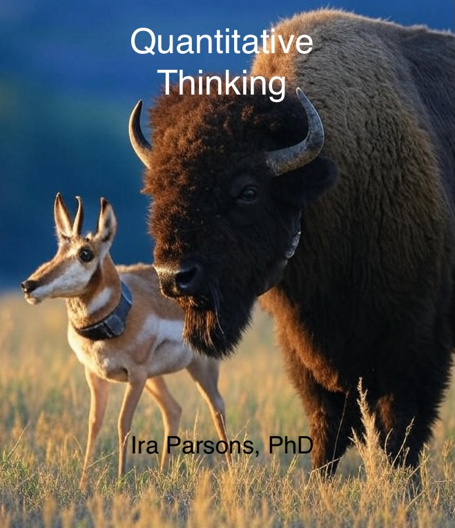

# The Nature of Knowledge {-}

Science is among the most powerful disciplines one can participate in. Fundamentally, science is the pursuit of knowledge, ideally fueled by an overpowering inquisitive desire to know more about the world around you. Hopefully if your reading this you already know that. But what you may not yet appreciate is the role and power of processing data to answer your questions. Data is facts, statistics, and knowledge collected together for reference, analysis, and reasoning or calculation that is collected together to represent a system we have an interest in learning more about. Data is fundamental to the progression of knowledge, and conducting the scientific process. The modern age has brought with it enormous advancements in technology, and massive amounts of data. For us, most data is the product of electrical impulses acting upon sensors which measure some aspect of the system. This may be the inductance of electricity within a scales weigh bars, the vector force along the axis of an accelerometer, the time taken for a GPS signal to reach the receiver from the satellite, or the magnitude of light reflected onto a cameras photo diode. Other data may include counts of things existing within a certain defined space at a defined temporal interval and recorded in a notebook. But even these data are then converted to some electronic format with all possible haste. All data processing should begin with an appreciation for how various sensors function, the capability of the observer, and other limitations. Understanding these will help inform you the specific aspect of the system (animal body-weight, greenness, position, number of animals etc.) the sensor (or human) is measuring. 

Because we live in a dynamic world, these data points captured independently are only somewhat informative. Real scientific power comes by understanding these measurements relative to other data collected in the same system along some interval. This is the foundation of mathematics, specifically algebra and calculus. However, because we live in a dynamic world, perfectly modeling nature is impossible for all intents and purposes. Thus, variation comes into play and we are tasked with assessing the relative variation we observe in the system and separating it from the affect we are exploring. This is known as probability. Statistics is the merger of theoretical mathematics with applied systems in the real world, and allows us to report results tempered by quantified uncertainty. *Simply put: Statistics is the science of Learning from Data*.

My goal of this coursework and textbook are for students to learn valuable critical thinking and problem solving skills. Students should learn to be confident in their problem solving skills and ability to continue learning. Students should exit the course with the ability to identify and carefully define problems, develop clear objectives, identify methods to solve those problems, clearly support the results they find with rational logic, and clearly communicate what you have done and learned in the context of the current body of knowledge to the greater world. Welcome to Quantitative Thinking.
## Acknowledgments {-}

Credit for material from this book are due to multiple people, including Dr. Gordon Carstens who agreed to release a dataset for examples, Dr. Garrett Street for creating the his class Fundamentals of Movement Ecology after which this class is loosely modeled, and to Drs. Mevin Hooten and Thomas Hobbs for creating a workshop in Bayesian Statistics. 

\BeginKnitrBlock{flushright}
Ira L. Parsons
Rapid City, South Dakota
\EndKnitrBlock{flushright}
